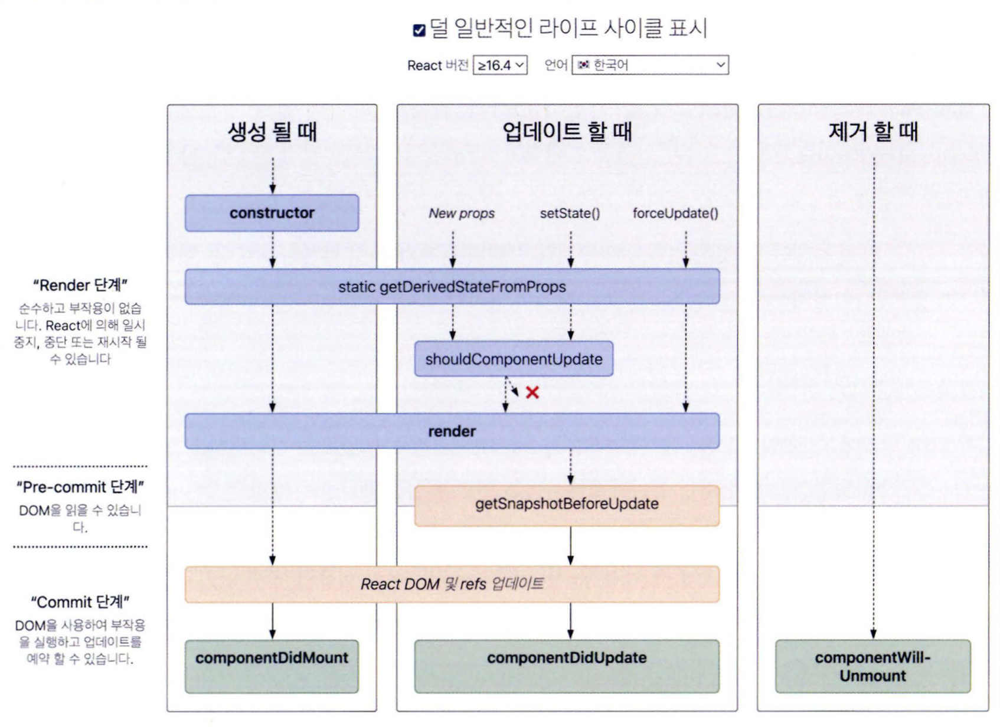

# 02. 리액트 핵심 요소 깊게 살펴보기

## 2.1 JSX란?

- jsx는 자바스크립트 내부에서 표현하기 까다로웠떤 트리구문을 작성하는 데 많은 도움을 주는 새로운 문법이다.
- jsx는 자바스크립트의 표준이 아닌 페이스북에서 임의로 만든 새로운 문법이다.
- JSX는 반드시 트랜스파일러를 거쳐야 자바스크립트 런타임이 이해할 수 있는 의미있는 자바스크립트 코드로 변환된다.

### 2.1.1 JSX 정의

> **JSXElement**

JSX를 구성하는 가장 기본요소, HTML의 요소(element)와 비슷한 역할을 한다.

```jsx
// 컴포넌트는 반드시 대문자로 시작한다.
// ㄴ 리액트에서 HTML태그명과 사용자가 만든 컴포넌트를 구분짓기 위함

const Component = {
   //JSXOpeningElement + JSXClosingElement
  return <div></div>

  //JSXselfClosingElement : 요소가 시작되고 스스로 종료되는 형태 , 자식포함 불가
  return <input />

  // JSXFragment 아무런 요소가 없는 형태
  return <></>
}
```

- 네이밍 규칙
  - 숫자, $, \_외의 특수문자 로 시작 불가
  - 식별자:식별자 :로 이어주는것도 하나의 식별자 (:로 묶을수 있는것은 한개 뿐)
  - 식별자.식별자 `:` 과는 다르게 `.`은 여러개를 이어 하나의 식별자로 만들 수 있다.

> **JSXAttributes**

JSX Element에 부여할 수 있는 속성을 의미한다.

> **JSXChildren**

JSXElement의 식 값을 나타낸다.
이로 인해 트리구조를 나타낼 수 있다.

> **JSXStrings**

문자열

```jsx
//jsx
const Component = (
  <div>
    <span>hello world</span>
  </div>
);

// transfile
var Component = React.createElement(
  "div",
  null,
  React.createElement("span", null, "hello world")
);
```

두 코드만 비교해도 jsx는 트리구조를 명확하게 한눈에 보기 편하다.

## 2.2 가상 DOM과 리액트 파이버

브라우저 렌더링 과정

1. 브라우저가 사용자가 요청한 주소를 방문해 html 파일을 다운로드 한다.
2. 브러우저 렌더링 엔진은 html을 파싱해 dom노드로 구성된 dom tree를 만든다.
3. 2번과정에 css 파일을 만나면 css파일도 다운로드 한다.
4. 브라우저 렌더링 엔진은 css도 파싱해 css노드로 구성된 cssom 트리를 만든다.
5. 2번에서 만든 dom노드를 순회, 사용자 눈에 보이는 노드만 방문한다
6. 눈에보이는 대상으로 해당 노드에 대한 cssom 정보를 찾아 css를 적용한다.
   layout : 어느 좌표에 나타나야하는지 계산하는 과정
   painting : 스타일

**가상 DOM**
웹페이지가 표시해야할 DOM을 일단 메모리에 저장하고 리액트가 실제 변경에 대한 준비가 완료 되었을 때 실제 브라우저의 DOM에 반영한다.

리액트 파이버를 통해 가상 DOM과 렌더링 최적화가 가능해진다.  
가상 DOM과 실제 DOM을 비교해 변경사항을 수집하고, 차이가 있으면 변경 정보를 가지고 있는 차이버를 기준으로 화면에 렌더링을 요청한다.

**reconciliation** :리액트가 어떤 부분을 새롭게 렌더링해야할지 가상DOM과 실제DOM을 비교하는 작업(알고리즘)

파이버는 state가 변경되거나 생명주기 메서드가 실행되거나 DOM의 변경이 필요한 시점이 실행된다.

**리액트 파이버트리**
파이버 트리는 리액트내에서 현재 모습을 담인 파이버트리와 작업중은 상태(workInProgress)를 나타내는 2개가 존재한다.
리액트 파이버의 작업이 끝나면 리액트는 단순히 포인터만 변경해 workInProgress트리를 현재 트리로 바꿔버린다. (더블 버퍼링)  
리액트에서 미처 다 그리지 못한 모습을 노출시키지 않기 위해 더블 버퍼링 기법을 쓰며, 이 더블 버퍼링은 커밋단계에서 일어난다.

**파이버의 작업순서**

```jsx
<A1>
  <B1>Hello World</B1>
  <B2>
    <C1>
      <D1 />
      <D2 />
    </C1>
  </B2>
  <B3 />
</A1>
```

1. A1의 beginWork()가 수행
2. A1은 자식이 존재함으로 B1로 이동해 beginWork()
3. B1은 자식이 없음으로 completeWork()수행, 형제인 B2로 넘어감
4. B2 biginWork() , 자식이 있음으로 C1으로 이동
5. C1 biginWork(), 자식이 있음으로 D1으로 이동
6. D1 biginWork()
7. D1은 자식이 없음으로 completeWork(), 형제인 D2로 넘어감
8. D2 biginWork(), 자식 없음으로 completedWork()
9. D2는 자식, 형제가 모두 없음으로 위로 이동해 C1,B2순으로 completedWork()
10. B2의 형태 노드인 B3로 이동해 beginWork()
11. B3는 형제도 자식도 없음으로 completedWork() 후 상위로 올라감
12. A1의 completedWork()수행
13. 루트 노드가 완성되는 순간, 최종적으로 commitWork() 수행되고 이중에서 변경사항을 비교해 업데이트가 필요한 변경사항이 DOM에 반영된다.

**setState로 업데이트가 발생했을때는 ? **
앞서 만든 current tree가 존재하고, setState로 인한 업데이트 요청을 받아 workInProgress tree를 다시 빌드하기 시작한다.  
리액트 애플리케이션은 트리를 비교해서 업데이트 하는 작업이 많이 일어나기때문에,  
반복적인 재조정 작업을 할 때마다 새롭게 파이버 자바스크립트 객체를 만드는 것은 리소스 낭비임으로,  
컴포넌트가 최초로 마운트 되는 시점에 생성되어 이후에는 객체를 재활용하기 위해 내부 속성값만 초기화하거나 바꾸는 형태로 트리를 업데이트한다.

파이버는 리액트 컴포넌트에 대한 정보를 1:1로 가지고 있다.  
리액트 아키텍쳐 내에서 비동기로 이루어진다.  
실제 브라우저 구조인 DOM에 반영하는 것은 동기적으로 일어나야하고,  
처리하는 작업이 많아 화면에 불완전하게 표시될 수 있는 가능성이 높으므로,  
메모리상에서 (가상)먼저 수행해서 최종적인 결과물만 실제 브라우저 DOM에 적용한다.

## 2.3 클래스 컴포넌트와 함수 컴포넌트

함수 컴포넌트에 훅이 등작하면서 상태나 생명주기 메서드 비슷한 작업을 할 수 있게 되며,  
상대적으로 보일러플레이트가 복잡한 클래스 컴포넌트보다 함수 컴포넌트를 많이 사용하게 되었다.

### 2.3.1 클래스 컴포넌트

constructor() : 컴포넌트 초기화되는 시점에 호출 , super()는 컴포넌틀 만들면서 상위 컴포넌트에 접근할 수 있게 해준다.  
props : 컴포넌트에 특정 속성을 전달하는 용도  
state : 클래스 컴포넌트 내부에서 관리하는 값, 변화가 있을 때마다 리렌더링 발생  
메서드 : 클래스 컴포넌트 내부에서 사용되는 함수

**생명주기 메서드**
생명주기 메서드가 실행되는 시점

- 마운트 : 컴포넌트가 마운팅(생성)되는 시점
- 업데이트 : 이미 생성된 컴포넌트의 내용이 변경되는 시점
- 언마운트 :컴포넌트가 더 이상 존재하지 않는 시점

render(): 컴포넌트가 ui를 렌더링하기 위해서 쓰인다. 마운트, 업데이트에서 일어난다.  
순수해야하며, 부수효과가 없어야한다.  
render() 내부에서 state를 직접 업데이트하면 안되며,state의 변경은 클래스컴프넌트의 매서드나, 다른 생명주기 내부에서만 발생해야한다.

componenetDidMount()  
클래스 컴포넌트가 마운트 되고 준비됐다면 실행된다.  
state 값을 변경하는것이 가능하며, 브라우저가 ui를 실제로 업데이트 하기 전에 실행되어 사용자가 변경되는 것을 눈치챌 수 없게 마든다.  
일반적으로 state를 다루는 것은 생성자에서 하는것이 좋으며, 생성자에서 할 수 없는 것 api호출 후 업데이트, dom에만 의존적인 작업(이벤트리스너 추가 등 )의 경우 setState를 하는것을 허용한다.

componentDidUpdate()  
컴포넌트 업데이트가 일어난 후 바로 실행된다.

componentWillUnmount()
컴포넌트가 언마운트 되거나 더이상 사용하지 않기 직전에 호출된다.
메모리누수, 클린업 함수를 호출하기 좋다.  
setState를 호출할 수 없다.

shouldComponentUpdate()  
state나 props의 변경으로 컴포넌트가 다시 리렌더링 되는 것을 막고싶을떄 사용한다.

static getDerivedStateFromProps()  
최근에 도입된 생명주기 메서드중 하나  
componentWillReceiveProps를 대체  
render() 호출하기 직전에 호출됨.  
static으로 선언되어있어서 this에 접근 불가.

getSnapShotBeforeUpdate()  
DOM이 업데이트 되기 직전에 호출  
componentWillUpdate()를 대체  
반환되는 값은 componentDidUpdate로 전달  
렌더링 되기 전에 윈도우 크기를 조절하거나 스크롤 위치를 조절하는 작업을 처리하는데 유용하다.



### 2.3.2 함수 컴포넌트

render 내부에서 필요한 함수를 선언할 때 this바딩딩을 조심할 필요가 없다.  
state는 각각의 원시값으로 관리 및 사용이 편리하다.

useEffect훅 : componentDidMount, componentDidUpdate, componentWillUnmount 를 비슷하게 구현할 수 있다.  
state를 활용해 동기적으로 부수효과를 만드는 메커니즘

## 2.4 렌더링은 어떻게 일어나는가?

### 렌더링이 일어나는 이유는?

최초 렌더링 : 사용자가 처음 애플리케이션에 진입했을 때  
리렌더링 : 최초 렌더링 이후 발생하는 모든 렌더링  
리렌더링이 일어나는 겨우

- state 변경 , useReducer()의 두번째 요소인 dispatchh가 실행되는 경우
- props가 변경 되었을 때
- 부모 컴포넌트가 리렌더링 되었을 때 자식 컴포넌트는 모두 리렌더링

**배열에서 하위 컴포넌트에서 key를 써야하는 이유는 ?**  
리렌더링이 발생하는 동안 형제 요소들 사이에서 동일한 요소를 식별하는 값  
리렌더링이 발생하면 current tree와 workInProgress tree사이에서 어떤 컴포넌트가 변경되었는지 구별해야하는데,  
두 트리 사이에서 같은 컴포넌트인지 비교하는 값이 key다.  
key가 없다면 파이버 내부의 sibling 인덱스만을 기준으로 판단한다.

### 렌더와 커밋

랜더단계 : 컴포넌트를 렌더링하고 변경 사항을 계산하는 모든 작업 , type, key, props로 체크  
커밋단계 : 렌더 단계의 변경 사항을 실제 DOM에 적용해 사용자에게 보여주는 작업 (useLayoutEffect 호출)  
렌더링 과정 중 첫번째 단계인 렌더단계에서 변경 사항을 감지할 수 없다면 커밋단계가 생략되어 브라우저의 DOM업데이트가 일어나지 않을 수 있다.

### 컴포넌트 함수의 무거운 연산을 기억해 두는 메모이제이션

useMemo, useCallback 훅과 고차 컴포넌트인 memo는 리액트에서 발생하는 렌더링을 최소한으로 줄이기 위해 사용된다.

**고차컴포넌트 memo**
메모이제이션도 비용이 드는 작업이다.

1. 값을 비교하고 렌더링 또는 재계산이 필요한지 확인하는 작업
2. 이전에 결과물을 저장해뒀다가 다시 꺼내와야한다.  
   섣부른 최적화는 경계해야한다.

memo를 하지 않았을 때 발생할 수 있는 문제

1. 렌더링을 함으로써 발생하는 비용
2. 컴포넌트 내부의 복잡한 로직의 재실행
3. 위 두가지고 모든 자식 컴포넌트에서 반복하여 일어난다.
4. 리액트가 구 트리와 신규 트리를 비교한다.
   memo를 하지 않았을 때 치러야할 잠재적인 위험비용이 더 크긴하다.

애플리케이션을 어느정도 만든 이후에 개발자도구나 useEFfect를 사용해 실제로 어떻게 렌더링이 일어나고 있는지 확인하고 필요한 곳에서만 최적화해야한다.

**useMemo / useCallback**
의존성 배열을 비교하고, 필요에 따라 값을 재계산한다.  
리렌더링 될 때 메모이제이션과 같은 별도 조치가 없다면 모든 객체는 재생성되고, 결과적으로 참조는 달라지게된다.

```jsx

  const getSquareValue= (value)=>{
    return value*value

    //memoization
    // return useMemo(()=>value*value,[value])
  }

const App = ()=>{

  const [counter,setCounter] = useState(0);
  const value = getSquareValue(3);
  useEffect(()=>{
    console.log('value changed');
  },[value])

  const handleClick = ()=>>{
    setState(prev=>prev+1)
  }
  return <>
  <h1>{counter}</h1>
  <button onClick={handleClick}></button>
  </>


}
```

버튼이 클릭되어 conter 변수가 변경되면 리렌더링이 된다.  
getSquareValue 함수의 경우 리렌더링 될 때마다 값의 참조가 달라지게 됨으로  
value는 같은 값을 가지더라도 참조가 달라서 변경된 것으로 감지한다.

메모이제이션을 할 경우, value가 변경되지 않는 이상 같은 결과물을 가져 참조의 투명성을 유지할 수 있게 된다.
