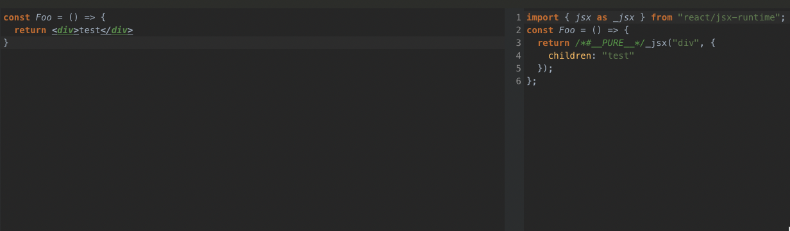

## 2장 리액트 핵심 요소 깊게 살펴보기

## JSX

`jsx`는 기본적으로 `JSXElement`, `JSXAttributes`, `JSXChildren`, `JSXStrings`라는 4가지 컴포넌트를 기반으로 구성되어있다.

### JSXElement

JSX를 구성하는 가장 기본요소. HTML의 요소와 비슷한 역할을 한다. `JSXOpeningElement`, `JSXClosingElement`, `JSXSelfClosingElement`, `JSXFragment`의 형태 중 하나여야 한다.

### JSXAttributes

JSXElement에 부여할 수 있는 속성을 의미한다.

### JSXChildren

JSXElement의 자식 값을 나타낸다. JSX는 속성을 가진 트리 구조 형태로 만들어지기 때문에 부모 자식 관계를 가지며, 그 자식을 나타낸다.

### JSXStrings

HTML에서 사용 가능한 문자열은 모두 JSXStrings에서도 사용 가능하다.

### Babel을 이용해서 트랜스파일 결과 확인하기

## 가상 DOM과 리액트 파이버

### 리액트 파이버

리액트 파이버는 리액트에서 관리하는 평범한 객체다. 파이버 재조장자가 관리하며, 가상 DOM과 실제 DOM을 비교해 변경 사항을 수집하고 차이가 있다면 변경에 관련된 정보를 가지고 있는 파이벌르 기준으로 화면에 렌더링을 요청한다.

파이버는 다음과 같은 일을 할 수 있다.

- 작업을 작은 단위로 분할하고 쪼갠 다음, 우선순위를 매긴다.
- 이러한 작업을 일시 중지하고 나중에 다시 시작할 수 있다.
- 이전에 했던 작업을 다시 재사용하거나 필요하지 않은 경우에는 폐기할 수 있다.

이런 모든 작업은 비동기로 일어난다.

리액트 요소는 렌더링 발생 시 새롭게 생성되지만, 파이버는 컴포넌트가 최초로 마운트되는 시점에 생성되어 이후에는 가급적이면 재사용된다. 이렇게 생성된 파이버는 상태가 변경되거나 생명주기 메서드가 실행되거나 DOM의 변경이 필요한 시점 등에 실행된다. 이때 리액트가 이 작업을 직접 바로 처리하거나 스케줄링하기도 한다. 즉, 이런 작업을 작은 단위로 나눠서 할 수도, 우선순위가 높은 작업은 가능한 빠르게 처리하거나, 낮은 작업은 연기시키는 등 유연하게 처리된다.

### 리액트 파이버 트리

파이버 트리는 리액트에서 두 개 존재하는데, 하나는 현재 모습의 트리이고, 다른 하나는 작업 중인 상태를 나타내는 workInProgress 트리다. 작업이 끝나면 리액트는 단순히 포인터만 변경해 workInProgress 트리를 현재 트리로 바꿔버린다. (더블 버퍼링)

더블 버퍼링은 커밋 단계에서 수행된다.

### 파이버의 작업 순서

1. 리액트는 beginWork() 함수를 실행해 파이버 작업을 수행한다. **더 이상 자식이 없는 파이버를 만날 때까지 트리 형식으로 진행**
2. 작업이 끝나면 다음 completeWork()함수를 실행해 파이버 작업을 완료
3. 형제가 있다면 형제로 이동
4. 2, 3번 모두 종료 시 return으로 돌아가 자신의 작업을 완료

위 동작으로 트리가 생성되고 난 뒤, 상태가 변경 등과 같은 이유로 업데이트가 발생하면, 업데이트 요청을 가지고 workInProgress 트리를 다시 빌드한다. 이때, 파이버가 이미 존재하므로 되도록 새로 생성하지 않고 기존 파이버에서 업데이트 된 props를 받아 파이버 내부에서 처리한다.

### 파이버와 가상 DOM

파이버는 리액트 아키텍처 내부에서 비동기로 이루어지지만, 실제 브라우저 구조인 DOM에 반영하는 것은 동기적으로 일어나야 한고, 처리하는 작업이 많아 화면에 불완전하게 표시될 수 있는 가능성이 높으므로 이러한 작업을 메모리상에서 먼저 수행해 최종적인 결과물만 실제 바르우저 DOM에 적용하는 것이다.

## 클래스 컴포넌트와 함수 컴포넌트

### 클래스 컴포넌트의 생명주기 메서드

생명주기 메서드가 실행되는 시점은 크게 3가지다.

- 마운트 : 컴포넌트가 생성되는 시점
- 업데이트 : 이미 생성된 컴포넌트의 내용이 변경되는 시점
- 언마운트 : 컴포넌트가 더 이상 존재하지 않는 시점

생명주기 메서드는 다음과 같다.

1. `render()` : 리액트 클래스 컴포넌트의 유일한 필수 값이다. 컴포넌트가 UI를 렌더링 하기 위해 사용된다.
2. `componentDidMount()` : 컴포넌트가 마운트되고 준비가 되면 호출된다.
3. `componentDidUpdate()` : 컴포넌트 업데이트가 일어난 후에 실행된다.
4. `componentWillUnmount()` : 컴포넌트가 언마운트되거나 더 이상 사용되지 않기 직전에 호출된다.
5. `shouldComponentUpdate()` : state나 props의 변경으로 리액트 컴포넌트가 다시 리렌더링 되는 것을 막고 싶을 때 사용한다.
6. `getDerivedStateFromProps()` : render를 호출하기 직전에 호출된다. static 메서드이기 때문에 this에 접근할 수 없다. 반환하는 객체의 내용이 모두 state로 들어가게 된다.
7. `getSnapShotBeforeUpdate()` : DOM 업데이트 직전에 호출된다. 반환되는 값은 componentDidUpdate로 전달된다. 렌더링 전 윈도우 크기를 조절하거나 스크롤 위치를 조정하는 등의 작업에 유용하다.

### 클래스 컴포넌트의 한계

- 데이터의 흐름을 추적하기 어렵다.
- 애플리케이션 내부 로직의 재사용이 어렵다.
- 기능이 많아질수록 컴포넌트의 크기가 커진다.
- 클래스는 함수에 비해 상대적으로 어렵다.
- 코드 크기를 최적화하기 어렵다.
- 핫 리로딩을 하는 데 상대적으로 불리하다.

### 함수 컴포넌트

함수 컴포넌트는 리액트 16.8 버전에서 훅이 등장하면서 각광받고 있다.
`render` 내부에서 필요한 함수를 선언할 때 this 바인딩을 조심할 필요도 없고, state는 객체가 아닌 각각의 원시값으로 관리되어 훨씬 사용하기 편하다. 또한 this를 사용하지 않더라도 props와 state에 접근할 수 있다.

### 함수 컴포넌트 vs 클래스 컴포넌트

#### 생명주기의 부재

함수 컴포넌트는 props를 받아 단순히 리액트 요소만 반환한다. 클래스 컴포넌트는 `render`메서드가 있는 `React.Component`를 상속받아 구현하는 클래스이기 때문에 생명주기 메서드가 존재한다. 즉, 클래스 컴포넌트가 아닌 이상 생명주기 메서드는 사용할 수 없다.

하지만, 함수 컴포넌트는 `useEffect`훅을 사용해서 생명주기 메서드를 비슷하게 구현한다.

#### 함수 컴포넌트와 렌더링된 값

함수 컴포넌트는 렌더링된 값을 고정하고, 클래스 컴포넌트는 그렇지 못하다.

클래스 컴포넌트는 props의 값을 항상 this에서 가져온다. 외부에서 변경되지 않는 한 불변값이지만, 컴포넌트의 인스턴스의 멤버는 변경가능한 갓ㅂ이다. 즉, `render`메서드를 비롯한 리액트의 생명주기 메서드가 변경된 값을 읽게 된다.

함수 컴포넌트는 props를 인수로 받는다. 컴포넌트는 그 값을 변경할 수 없고, 해당 값을 그대로 사용하게 된다. 상태도 마찬가지다. 함수 컴포넌트는 렌더링이 일어날 때마다 그 순간의 값인 props와 상태를 기준으로 렌더링된다. props와 상태가 변경된다면, 다시 한 번 그 값을 기준으로 함수가 호출된다고 볼 수 있다. 하지만, 클래스 컴포넌트는 시간의 흐름에 따라 변화하는 this를 기준으로 렌더링이 일어난다.

## 렌더링은 어떻게 일어나는가?

리액트의 렌더링은 브라우저가 렌더링에 필요한 DOM트리를 만드는 과정을 의미한다. 리액트의 렌더링은 시간과 리소스를 소비해 수행되는 과정으로, 이 비용은 모두 웹 애플리케이션을 방문하는 사용자에게 청구되며, 시간이 길어지고 복잡해질수록 유저의 사용자 경험을 저해한다.

### 리액트의 렌더링

리액트에서의 렌더링이란 리액트 애플리케이션 트 리 안에 있는 모든 컴포넌트들이 현재 자신들이 가지고 있는 props와 state의 값을 기반으로 어떻게 UI를 구 성하고 이를 바탕으로 어떤 DOM 결괴를 브라우저에 제공할 것인지 계산하는 일련의 과정을 의미한다.

### 리액트의 렌더링이 일어나는 경우

1. 최초 렌더링
2. 리렌더링 : 클래스 컴포넌틔 setState가 실행, 클래스 컴포넌트의 forceUpdate가 실행, 함수 컴포넌트의 useState()의 setter가 실행, 함수 컴포넌트의 useReducer()의 dispatch가 실행, 컴포넌트의 key props가 변경, props가 변경, 부모 컴포넌트가 렌더링

### 렌더와 커밋

렌더 단계(Render Phase)는 컴포넌트를 렌더링하고 변경 사항을 계산하 는 모든 작업을 말한다. 비교하는 것은 type, props, key로, 하나라도 변경되면 변경이 필요한 컴포넌트로 체크한다.

커밋 단계는 렌더 단계의 변경 사항을 실제 DOM에 반영하는 과정이다. 렌더링을 수행하고, 커밋 단계가 필요없다면, 커밋 단계는 생략될 수 있다.

기존에는 이 단계를 동기적으로 실행했지만, 리액트 18부터는 비동기 렌더링(동시성 렌더링)을 도입했다. 렌더 단계가 비동기로 작동해 특정 렌더링의 우선순위를 낮추거나, 필요하다면 중 단하거나 재시작하거나, 경우에 따라서는 포기할 수도 있다. 이를 통해 브라우저의 동기 작업을 차단하지 않 고 백그라운드에서 새로운 리액트 트리를 준비할 수도 있으므로 시용지는- 더욱 매끄러운 사용자 경험을 누릴 수 있다.

## 메모이제이션

메모이제이션은 리액트의 컴포넌트의 렌더링이 자주 일어나고, 연산이 비싸다면 고려할 수 있다. 굳이 렌더링을 다시 할 필요가 없거나, 계산이 필요가 없는 값을 최적화할 수 있다. 하지만, 이 역시 다시 계산을 해야하는 지 비교하는 연산이 필요하기 때문에 비용이 소모되는 것은 맞다.

즉, 굳이 최적화가 필요하지 않는 것에 대해 최적화를 하게 되면 불필요한 연산이 추가로 들어갈 수 있게되는 것이다.

하지만, 렌더링 자체가 큰 비용이 드는 동작이기 때문에, 일정 비용을 소모를 감수하더라도 메모이제이션을 미리하는 것도 방법이 될 수 있다.
