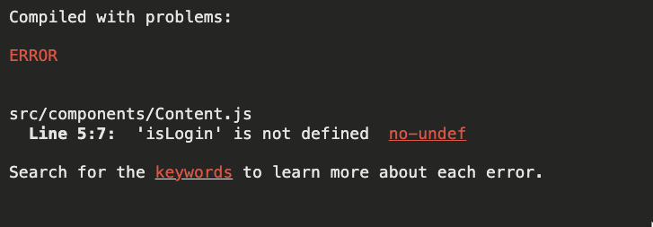
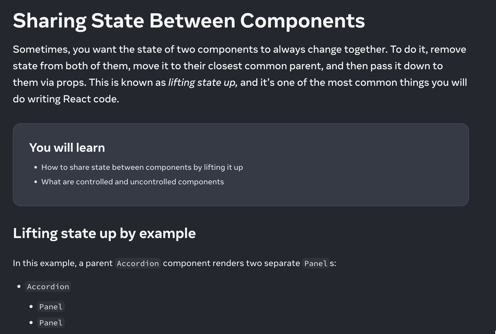

## 상태 관리 라이브러리

### 상태 관리 라이브러리 사용하기

리액트 개발은 컴포넌트 단위로 이루어진다. 그리고 상태를 이용해서 랜더링 결과를 조정할 수 있다.

아래 컴포넌트는 타이틀 바에 로그인 버튼 예시이다. 로그인 여부에 따라 버튼의 텍스트가 바뀌게 된다.

```jsx
import { useState } from "react";
export const TitleBar = () => {
  const [isLogin, setIsLogin] = useState(false);

  const onClick = () => {
    setIsLogin((prev) => !prev);
  };
  return (
    <div>
      <button onClick={onClick}>{isLogin ? "sign out" : "sign in"}</button>
    </div>
  );
};
```

그렇다면, 로그인 여부에 따라서 하단에 보여지는 UI가 변경되어야 하는 경우는 어떻게 처리할까?

```jsx
import { useState } from "react";
export const TitleBar = () => {
  const [isLogin, setIsLogin] = useState(false);

  const onClick = () => {
    setIsLogin((prev) => !prev);
  };
  return (
    <div>
      <button onClick={onClick}>{isLogin ? "sign out" : "sign in"}</button>
      <div>
        {isLogin ? (
          <div>로그인 되었습니다.</div>
        ) : (
          <div>로그인이 필요합니다.</div>
        )}
      </div>
    </div>
  );
};
```

위와 같이 로그인 여부에 따라 UI를 다르게 보여줄 수 있을 것이다. 지금은 컴포넌트가 작고 상태를 하나만 사용해서 나타내고 있지만, 만약 컴포넌트가 커지게 되면 어떻게 해야할까?

하나의 컴포넌트에 모든 UI 코드를 다 때려 박아 넣으면 될까? 리액트 개발자라면 자연스럽게 컴포넌트의 성격에 따라 분리하게 될 것이다.

```jsx
export const Content = () => {
  return (
    <div>
      {isLogin ? (
        <div>로그인 되었습니다.</div>
      ) : (
        <div>로그인이 필요합니다.</div>
      )}
    </div>
  );
};
```

위와 같이 `TitleBar`와 `Content`를 분리했다.



여기서 문제가 발생한다. `Content`는 `isLogin`이라는 상태를 가지고 있지 않는 것이다. 이렇게 여러 컴포넌트에서 **하나의 상태를 공유**해야할 때 어떻게 해야할까?

바로 상태 끌어올리기를 사용하는 것이다.



코드를 수정하면 아래와 같이 된다.

```jsx
// App.js
import { TitleBar } from "./components/TitleBar";
import { Content } from "./components/Content";
import { useState } from "react";
function App() {
  const [isLogin, setIsLogin] = useState(false);

  const onClick = () => {
    setIsLogin((prev) => !prev);
  };
  return (
    <>
      <TitleBar onClick={onClick} isLogin={isLogin} />
      <Content isLogin={isLogin} />
    </>
  );
}

export default App;

// TitleBar.js
export const TitleBar = ({ onClick, isLogin }) => {
  return (
    <div>
      <button onClick={onClick}>{isLogin ? "sign out" : "sign in"}</button>
    </div>
  );
};

// Content.js
export const Content = ({ isLogin }) => {
  return (
    <div>
      {isLogin ? (
        <div>로그인 되었습니다.</div>
      ) : (
        <div>로그인이 필요합니다.</div>
      )}
    </div>
  );
};
```

이렇게 여러 컴포넌트에서 상태를 공유하기 위해서는 상태 끌어올리기를 사용한다. 즉, 공유되어야할 상태를 그 상태가 필요한 모든 컴포넌트를 자식으로 두고 있는 부모 컴포넌트에서 만들고 하위로 내려주는 방식이다.

이러면 문제는 해결된다. 하지만, 프로젝트 규모가 커지면? 위와 같이 단순히 하나의 깊이로 이루어진 컴포넌트면 상관없지만, 깊이가 깊어지고 전달할 상태가 많아지면 상태가 어디에서 사용되고, 상태 변경을 하는지 확인하기 어려워질 것이다. 또한, 단순히 상태를 전달만 하는 중간 컴포넌트들은 상태가 변경되었을 때 의미없이 리랜더링이 되는 문제가 생길 것이다.

이렇게 상태 관리가 복잡해지는 경우 고려해볼 수 있는 것이 바로 **상태 관리 라이브러리**다. 상태 관리 라이브러리를 소개하는 것은 책으로 충분하니 넘어간다.

[리덕스 사용해보기](https://velog.io/@crowwan/%EB%A6%AC%EB%8D%95%EC%8A%A4-%EC%82%AC%EC%9A%A9%ED%95%B4%EB%B3%B4%EA%B8%B0)

## 클라이언트 상태 관리 vs 서버 상태 관리

리덕스와 같이 전역 상태 관리를 하면서 여러 컴포넌트에서 쉽게 상태를 공유하고 관리하게 되었다. 하지만, 실제 리액트 개발을 하면 단순히 클라이언트의 상태만 관리하게 되는 경우보다 서버에서 데이터를 받아와서 그 데이터를 관리해야하는 경우가 훨씬 많다는 것을 느낄 것이다.

이때, 리덕스를 이용해서 어떻게 서버 데이터를 관리했는지 보면,

### 1. Slice 생성

```jsx
import { createSlice, createAsyncThunk } from "@reduxjs/toolkit";

// 비동기 액션 생성
export const fetchTodos = createAsyncThunk("todos/fetchTodos", async () => {
  const response = await fetch("https://jsonplaceholder.typicode.com/todos");
  const todos = await response.json();
  return todos;
});

const todosSlice = createSlice({
  name: "todos",
  initialState: {
    items: [],
    status: "idle", // 'idle' | 'loading' | 'succeeded' | 'failed'
    error: null,
  },
  reducers: {},
  extraReducers: (builder) => {
    builder
      .addCase(fetchTodos.pending, (state) => {
        state.status = "loading";
      })
      .addCase(fetchTodos.fulfilled, (state, action) => {
        state.status = "succeeded";
        state.items = action.payload;
      })
      .addCase(fetchTodos.rejected, (state, action) => {
        state.status = "failed";
        state.error = action.error.message;
      });
  },
});

export default todosSlice.reducer;
```

### 2. Store 구성

```jsx
import { configureStore } from "@reduxjs/toolkit";
import todosReducer from "./todosSlice";

export const store = configureStore({
  reducer: {
    todos: todosReducer,
  },
});
```

### 3. Store 적용

```jsx
import React from "react";
import ReactDOM from "react-dom";
import { Provider } from "react-redux";
import App from "./App";
import { store } from "./store";

ReactDOM.render(
  <Provider store={store}>
    <App />
  </Provider>,
  document.getElementById("root")
);
```

### 4. 상태 사용

```jsx
import React, { useEffect } from "react";
import { useSelector, useDispatch } from "react-redux";
import { fetchTodos } from "./todosSlice";

function Todos() {
  const dispatch = useDispatch();
  const { items, status, error } = useSelector((state) => state.todos);

  useEffect(() => {
    dispatch(fetchTodos());
  }, [dispatch]);

  if (status === "loading") return <div>Loading...</div>;
  if (error) return <div>Error: {error}</div>;

  return (
    <ul>
      {items.map((todo) => (
        <li key={todo.id}>{todo.title}</li>
      ))}
    </ul>
  );
}

export default Todos;
```

이렇게 복잡한 코드를 작성했어야 했다. 상태 관리를 위해 액션, 리듀서 등을 정의하고, 비동기 작업을 처리하기 위한 미들웨어를 사용하게 되면서, 서버 데이터와 클라이언트의 상태들이 하나의 라이브러리로 관리되게 되어 오히려 복잡도가 증가했다.

서버 상태는 클라이언트 상태와 다르게 추가로 구현해야할 로직이 많다. 데이터 패칭 상태, 캐싱 등의 기능의 로직을 모두 구현할 것이 아니면 서버 상태 관리 라이브러리가 좋은 해결책이 될 수 있다. 이때 사용할 수 있는 라이브러리는 `React Query`나 `SWR`이 있다.

위 리덕스 코드를 리액트 쿼리를 이용해서 구현하면 아래와 같다.

```jsx
import React from "react";
import { useQuery } from "react-query";

// API 요청을 수행하는 함수
const fetchTodos = async () => {
  const response = await fetch("https://jsonplaceholder.typicode.com/todos");
  if (!response.ok) {
    throw new Error("Network response was not ok");
  }
  return response.json();
};

function Todos() {
  // useQuery를 사용하여 데이터 패칭 및 캐싱
  const { data, error, isLoading, isError } = useQuery("todos", fetchTodos);

  if (isLoading) return <div>Loading...</div>;
  if (isError) return <div>Error: {error.message}</div>;

  return (
    <ul>
      {data.map((todo) => (
        <li key={todo.id}>{todo.title}</li>
      ))}
    </ul>
  );
}
```

[React Query & Zustand](https://youtu.be/nkXIpGjVxWU?si=TmaW6CNY24kSXoSd)

이렇게 상태 관리 라이브러리를 적절하게 사용하면 리액트 개발에 많은 도움이 될 수 있다. 하지만, 간단한 상태 관리에 복잡한 라이브러리를 사용하면 오히려 프로젝트의 복잡성이 높아지고 러닝 커브가 증가한다. 또한, 상태 관리 로직이 과도하게 분산되어 있거나 복잡해지면, 코드의 가독성이 떨어지고 유지보수가 어려워질 수 있으니 남용하면 안된다.
