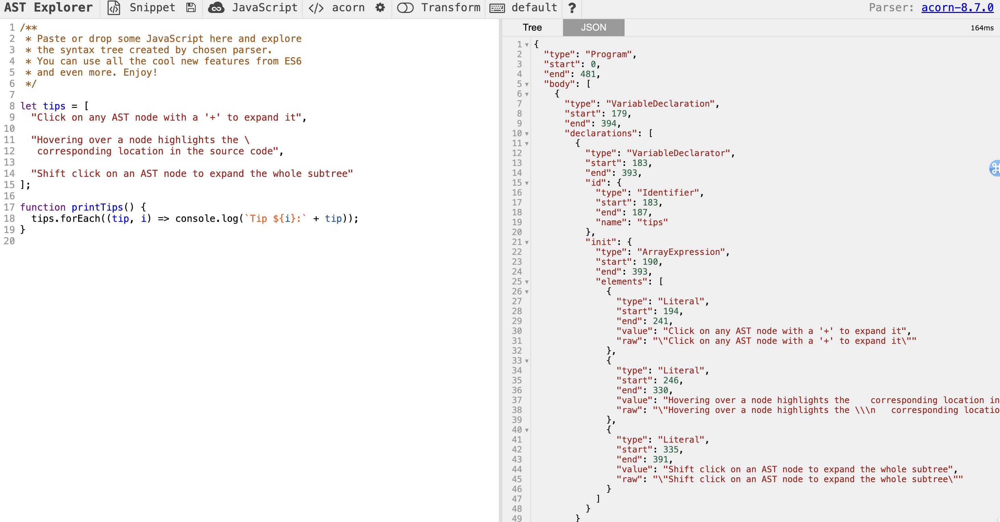

## 좋은 리액트 코드 작성을 위한 환경 구축하기

### ESLint를 활용한 정적 코드 분석

ESLint가 코드를 분석하는 방법

1. 자바스크립트 코드를 문자열로 읽는다.
2. 자바스크립트 코들르 분석할 수 있는 파서로 코드를 구조화한다.
3. 2번에서구조화한 트리를 AST라 하며, 이 구조화된 트리를 기준으로 각종 규칙과 대조한다.
4. 규칙과 대조했을 때 이를 위반한 코드를 알리거나 수정한다.



### eslint-plugin과 eslint-config

#### eslint-plugin

eslint-plugin이라는 접두사롤 시작하는 플러그인은 lint 규칙들을 모아놓은 패키지다.

비록 ESLint는 말 그대로 코드 정적 분석 도구라서 key가 유니크한 값인지까지는 확 인해 줄 수 없지만 존재 여부만 확인해도 큰 도움을 받을 수 있다. JSX 배열에서 key가 누락된 경우에 경 고를 보여주기 위해 이 규칙에서 export히는 create 함수를 살펴보면 개발자 입장에서는 별거 아닌 것 같아 보이는 규칙을 위해 엄청나게 복잡한 코드가 숨겨져 있다는 것을 알 수 있다.

#### eslint-config

eslint-plugin을 한데 묶어 완벽하게 한 세트로 제공되는 패키지다.

> eslint-plugin, eslint-config는 접두사를 준수해야 하고, 반드시 한 단어로 구성해야 한다.

### 나만의 ESLint 규칙 만들기

기존의 규칙을 커스터마이징 하려면 `.eslintrc.js`파일에서 규칙을 수정하면 된다.

만약 완전히 새로운 규칙을 만들고자 한다면, ast를 확인하고 원하는 조건을 eslint 규칙에 추가하자.

```js
/**
 * @type (import('eslint')).Rule.RuleModule)
 */

module.exports = {
  meta: {
    type: 'suggestion',
    docs: {
      description: 'disallow use of the new Date()'
      recommended: fa;se,
    },
    fixable: 'code',
    schema: [],
    messages:{
      message: 'new Date()는 클라이언트에서 실행 시 해당 기긱의 시간에 의존적이라 정확하지 않습니다. 현재 시간이 필요하다면 ServerDate()를 사용해주세요.'
    }
  },
  create: function (context){
    return {
      NewExpression: function (node){
        if(node.callee.name === 'Date' && node.arguments.length === 0){
          context.report({
            node: node,
            messageId: 'message',
            fix: function (fixer){
              return fixer.replaceText(node, 'ServerDate()')
            }
          })
        }
      }
    }
  }
}
```

이때, `meta`는 해당 규칙과 관렫뇐 정보를 나타낸다. `create` 함수는 객체를 반환해야 하는데, 이 객체에서는 코드 스멜을 감지할 선택자나 이벤트명 등을 선언할 수 있다. 여기서는 `callee.name`이 `Date`이고, 인자가 없는 경우를 찾는다. 이를 찾았다면, `context.report`로 리포트를 하고 문제가 되는 `node`와 찾았을 때 노출시키고 싶은 `message`를 가리킨다.

### 주의할 점

Prettier는 코드의 포매팅을 도와주는 도구다. ESLint와 마찬가지로 코드를 정적 분석해서 문제를 해결 한다는 점은 동일하지만, 두 패키지가 지향하는 목표는 다르다. ESLint는 코드의 잠재적인 문제가 될 수 있는 부분을 분석해 준다면, Prettier는 포매팅과 관련된 작업, 즉 줄바꿈, 들여쓰기, 작은따옴표와 큰따옴 표 등을 담당한다. 자바스크립트에서만 작동하는 ESLint와는 다르게, Prettier는 자바스크립트뿐만 아니 라 HTML, CSS, 마크다운, JSON 등 다양한 언어에도 적용 가능하다. 여기서 문제는 Prettier와 ESLint가 서로 충돌을 일으킬 수 있다는 것이다. 즉, ESLint에서도 Prettier에서 처리하는 작업을 처리할 수 있기 때문에 두 가지 모두를 자바스크립트 코드에서 실행한다면 서로 충돌하는 규칙으로 인해 에러가 발생하고, 최악의 경우 ESLint, Prettier 모두 만족하지 못하는 코드가 만들어질수도있다.

## 리액트 팀이 권장하는 리액트 테스트 라이브러리

프런트엔드와 백엔드 모두 데스팅이 중요하지만 테스트하는 방법과 방법론은 다르다. 백엔드의 테스트는 일반적으로 서버나 데이터베이스에서 원하는 데이터를 올바르게 가져올 수 있는지, 데이터 수정 간 교착 상태나 경쟁 상태가 발생하지는 않는지, 데이터 손실은 없는지, 특정 상황에서 장애가 발생하지 않는지 등을 확인하는 과정이 주를 이룬다. 이러한 백엔드 테스트는 일반적으로 **화이트박스** 테스트로, 작성한 코드가 의도대로 작동하는지 확인해야 하며, 이는 GUI가 아닌 AUI(Application User Interface; 응용 프로그램 사 용자 인터페이스)에서 주로 수행해야 하기 때문에 어느 정도 백엔드에 대한 이해가 있는 사람만 가능하다.

반면 프런트엔드는 일반적인 사용자와 동일하거나 유사한 환경에서 수행된다. 사용자가 프로그램에서 수행 할 주요 비즈니스 로직이나 모든 경우의 수를 고려해야 하며, 이 과정에서 사용자는 굳이 프런트엔드 코드를 알 필요는 없다. 즉, **블랙박스** 형태로 테스트가 이뤄지며, 코드가 어떻게 됐든 상관없이 의도한 대로 작동하는지를 확인하는 데 좀 더 초점이 맞춰져 있다. 그리고 시나리오가 어느 정도 정해져 있는 백엔드와 다르 게, 프런트엔드는 사용자에게 완전히 노출된 영역이므로 어떻게 작동할지 최대한 예측해서 확인해야 한다. 사용자는 개발자의 의도대로만 사용하지 않기 때문이다.

```jsx
import { Typography, Box, Link as MuiLink } from "@mui/material";
import React from "react";
import { useNavigate } from "react-router-dom";

import { pageRoutes } from "@/apiRoutes";

const EmptyNotice = () => {
  const navigate = useNavigate();

  const handleClickBack = () => {
    navigate(pageRoutes.main);
  };

  return (
    <Box
      sx={{
        display: "flex",
        justifyContent: "center",
        height: 400,
        alignItems: "center",
        flexDirection: "column",
      }}
    >
      <Typography sx={{ fontSize: "50px", fontWeight: "light" }}>
        텅~
      </Typography>
      <MuiLink
        underline="hover"
        onClick={handleClickBack}
        style={{ cursor: "pointer" }}
        role="link"
      >
        홈으로 가기
      </MuiLink>
    </Box>
  );
};

export default EmptyNotice;
```

```jsx
import { screen } from "@testing-library/react";
import React from "react";

import EmptyNotice from "@/pages/cart/components/EmptyNotice";
import render from "@/utils/test/render";

const navigateFn = vi.fn();

vi.mock("react-router-dom", async () => {
  const original = await vi.importActual("react-router-dom");

  return { ...original, useNavigate: () => navigateFn };
});

it('"홈으로 가기" 링크를 클릭할경우 "/"경로로 navigate함수가 호출된다', async () => {
  const { user } = await render(<EmptyNotice />);
  await user.click(screen.getByText("홈으로 가기"));

  expect(navigateFn).toHaveBeenNthCalledWith(1, "/");
});
```

### 테스트 작성에 앞서 고려할 점

흔히들 알고 있는 사실 중 하나는 데스트 커버리지가 높을수록 좋고 꾸준히 테스트 코드를 작성하라는 것이다. 그러나 테스트 커버리지가 만능은 아니다. 먼저 테스트 커버리지는 단순히 얼마나 많은 코드가 테스트되고 있는지를 나타내는 지표일 뿐, 테스트가 잘되고 있는지를 나타내는 것은 아니다. 그러므로 절대 테스트 커버리지를 맹신해서는 안 된다.

또 한 가지 알아둬야 할 점은 테스트 커버리지를 100%까지 끌어올릴 수 있는 상황은 생각보다 드물다는 것이다. 이른바 TDD라고 하는 개발 방법론을 차용해서 테스트를 우선시하더라도 서버 코드와는 다르게 프런트 엔드 코드는 사용자의 입력이 매우 자유롭기 때문에 이러한 모든 상황을 커버해 테스트를 작성하기란 불가능하다. 그리고 실무에서는 테스트 코드를 작성하고 운영할 만큼 여유로운 상황이 별로 없다. 때로는 테스트를 QA에 의존해 개발을 빠르게 진행 해야 할 수도 있고, 이후에 또 개발해야 할 기능이 산적해 있을 수도 있다.
