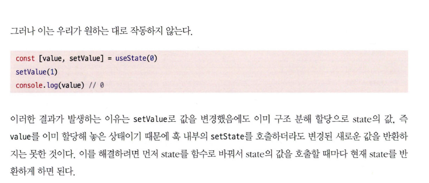
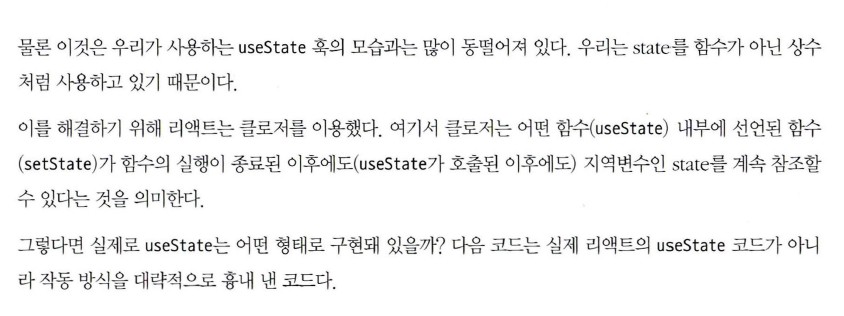

# 리액트 훅 깊게 살펴보기

## 리액트의 모든 훅 파헤치기

### 3.1.11 훅의 규칙

리액트 훅에는 몇 가지 규칙이 있다. (이 규칙을 모르고 useState, useEffect에 대한 설명을 보다가 너무 헷갈렸다.)

- 최상위에서만 훅을 호출해야 한다. 반복문, 조건문, 중첩된 함수 내에서 훅을 호출하면 안된다. 이 규칙은 훅이 호출되는 순서를 보장하기 위한 것이다.
- 훅은 함수형 컴포넌트 혹은 사용자 정의 훅 안에서만 호출되어야 한다.

```jsx
function Component() {
  const [count, setCount] = useState(0);
  const [required, setRequired] = useState(false);

  useEffect(() => {
    // do something
  }, [count, required]);
}
```

이 컴포넌트는 파이버에서 다음과 같이 저장된다.

```jsx
{
  // setCount 훅
  memoizedState: 0,
  baseState: 0,
  queue: { /* ... */ },
  baseUpdate: null,
  next: {
    // setRequired 훅
    memoizedState: false,
    baseState: false,
    queue: { /* ... */ },
    baseUpdate: null,
    next: {
      // useEffect 훅
      memoizedState: {
        tag: 192,
        create: () => {},
        destroy: undefined,
        deps: [0, false],
        next: { /* ... */ }
      },
      baseState: null,
      queue: null,
      baseUpdate: null
    }
  }
}
```

### 3.1.1 useState

함수 컴포넌트 내부에서 상태를 정의하고 변경할 수 있게 해주는 훅이다.

```jsx
const [state, setState] = useState(initialState);
```

useState가 호출되면 리액트는 new state 값을 저장하기도 하겠지만 useState 훅 정보를 파이버에 저장할 것이다. setState를 통해 값이 변경되면 해당 useState와 이후에 등록된 훅들을 파이버를 통해 순회할 것이다. (자식 컴포넌트 렌더링)

#### 부모 컴포넌트가 렌더링 되면 자식 컴포넌트도 렌더링 되는 이유

리액트 훅들의 순서는 고정되어 있다.
리액트가 렌더링될 때마다 부모 컴포넌트부터 시작해서 자식 컴포넌트로 넘어간다. 각각의 함수 컴포넌트들이 호출될 때 그 안에 선언된 훅들 또한 호출된다.
setState 같은 함수를 호출하면 리액트는 파이버의 링크드 리스트 구조에 따라 다음 훅들(자식 포함)을 호출하며 렌더링한다. (하겠지)

#### useState simple 상상도

```jsx
function useState(initialValue) {
  let internalState = initialValue;

  function setState(newValue) {
    internalState = newValue;
  }

  return [internalState, setState];
}
```




이게 무슨 :dog:소리야?

위에 코드는 internalState가 구조분해할당 되면서 사용되니까 안된다고 그러는데, 되는 예시도 구조분해할당은 마찬가지이며 클로져 덕분에 가능한 것처럼 얘기함. 이해가 안되는데요?



```jsx
const MyReact = (function () {
  const global = {};
  let index = 0;

  function useState(initialValue) {
    if (!global.states) {
      global.states = [];
    }

    const currentState = global.states[index] || initialValue;
    global.states[index] = currentState;

    const setState = (function (index) {
      return function (newState) {
        global.states[index] = newState;
        // 리렌더링 트리거는 안하나?
      };
    })(index);

    index += 1;

    return [currentState, setState];
})();

function Component() {
  const [value, setValue] = useState(0);

  return (
    <div>
      <p>{value}</p>
      <button onClick={() => setValue(value + 1)}>Increase</button>
    </div>
  )
}
```

위에 코드가 책에 나온 거랑 완전히 똑같지는 않고 코파일럿으로 적당히 수정한 코드인데,
이게 클로져 덕분에 지역변수를 참조해서 된다고? 포인터를 반환한 건가요? 구조분해할당 하는 건 똑같은데요?

그보다 나의 추측은...

- `setState(newValue)`를 호출함 -> 리액트 어딘가에 newValue 값이 저장됨 -> 리렌더링 트리거됨 -> `useState(0)`가 다시 호출됨 -> 이미 리액트 어딘가에 저장된 newValue 값을 리턴함 -> 클로저가 아니어도 OK?


- 그러니까 newValue를 참조하기 위해서 보다는 setState 시 올바른 index에 값을 저장하기 위해서 클로져를 쓴 거 아닌가?

#### 게으른 초기화

initialState 설정할 때 숏서킷에 의해 리렌더링 시 호출되지 않음

### 3.1.2 useEffect

리액트 컴포넌트가 렌더링될 때마다 의존성 배열의 변경 시 특정 작업을 수행하도록 설정할 수 있는 훅이다.

```jsx
useEffect(() => {
  // do something
}, [count, required]);
```

- useEffect는 렌더링이 끝난 이후 실행되므로 서버 사이드 렌더링 관점에서도 클라이언트 사이드에서 실행되는 것을 보장한다.

```jsx
const MyReact = (function () {
  const global = {};
  let index = 0;

  function useEffect(callback, dependencies) {
    const hooks = global.hooks;

    let previousDeps = hooks[index];

    let isDependenciesChanged = previousDeps
      ? dependencies.some((dep, index) => !Object.is(dep, previousDeps[index])) // 얕은 비교
      : true;

    if (isDependenciesChanged) {
      callback();
      index++;
      hooks[index] = dependencies;
    }

    return { useEffect };
  }
})();
```

아직까진 책에서 든 예시가 없었다면 생각 조차 안해봤을 것 같은 것들이 좀 있는 듯

### 3.1.3 useMemo

useEffect는 의존성이 바뀌면 callback을 실행(return type: void)하고 바뀌지 않으면 실행하지 않는다.
useMemo는 의존성이 바뀌면 callback을 실행하여 새로운 값을 반환하고 바뀌지 않으면 이전 값을 반환한다.

### 3.1.4 useCallback

useCallback은 의존성이 바뀌면 callback을 새로 생성하고 바뀌지 않으면 이전 callback을 반환한다.

- callback도 컴포넌트의 prop으로 들어가니까 리렌더링에 영향을 미치기 때문에 최적화를 위해서 사용함.

### 3.1.5 useRef

useRef는 렌더링을 트리거하지 않는다. (아마 state도 그냥 쓰면 렌더링하지 않겠지)
이거는 잘 모르겠음

### 3.1.6 useContext

```jsx
const Context = createContext<{ hello: string } | undefined>(undefined);

function ParentComponent() {
  return (
    <Context.Provider value={{ hello: 'typescript' }}>
      <Context.Provider value={{ hello: 'javascript' }}>
        <ChildComponent />
      </Context.Provider>
    </Context.Provider>
  );
}

function ChildComponent() {
  const value = useContext(Context);
  return <div>{value ? value.hello : ''}</div>; // 결과는 javascript가 반환된다.
}
```

이걸 보면 전역변수랑 뭐가 다르냐는 생각이 든다. 물론 진짜 전역변수를 쓰거나 드릴링 하는 것보다 사용하기는 더 편리해보이지만 나중에 헬게이트 열릴듯.

### 3.1.7 useReducer

이거는 걍 단순한 것 같은데 책 설명이 복잡함 (이상한 예시).
setState처럼 인자를 통해 값을 직접 바꾸는게 아니라 dispatch를 통해 간접적으로 값을 바꾸도록 제한하는 것 같다. 약간은 map-reduce 할 때의 reduce와 비슷한 것 같기도 하다.

```jsx
const useReducer = (reducer, initialState, init) => {
  const [state, setState] = useState(init ? init(initialState) : initialState);

  const dispatch = (action) => {
    const nextState = reducer(state, action);
    setState(nextState);
  };

  return [state, dispatch];
};
```

### 3.1.8 useImperativeHandle

필요 없어 보임

### 3.1.9 useLayoutEffect

더 필요 없어 보임

### 3.1.10 useDebugValue

굳이 필요 없어 보임

## 3.2 사용자 정의 훅과 고차 컴포넌트 중 무엇을 써야할까?

알잘딱 하라는 말을 길게 돌려놨음. 예시가 와닿는게 없다.. 🥲


