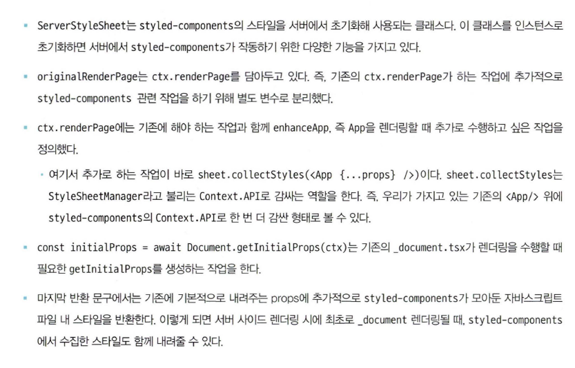

# 04 서버 사이드 렌더링

## SPA, MPA, and SSR

- SPA: 페이지를 처음 요청할 때 모든 리소스를 불러오고 이후에는 페이지 전환 시에 필요한 데이터만 불러온다.
- MPA(Multi Page Application): 페이지를 요청할 때마다 새로고침을 하면서 페이지 전체를 불러온다. 정통적인 웹사이트 방식이고 SSR이긴 하지만 요즘 말하는 SSR과는 다르다.
- SSR(Server Side Rendering): 서버에서 첫 페이지를 렌더링한 후 클라이언트에게 전달한다. 이후의 페이지 전환 시에는 클라이언트에서 렌더링한다.

SSR 하는 것 자체가 도전이라고 생각할 정도로 쉽지 않다. 그래서 Next.js 같은 프레임워크를 사용한다.
모놀리식 아키텍쳐와 MSA를 선택할 때 유의해야 하는 것처럼 SSR을 선택할 때도 장단점이 있다. (장단점은 생략)

## Next.js

- 클라이언트 사이드 렌더링과 서버 사이드 렌더링이 뒤섞여 있는 느낌이다.
- 서버에서 렌더링 되는 경우 window, document에 접근할 수 없는 것, protocol과 host 없이 path만으로 API 요청을 할 수 없는 것 등 브라우저가 제공하는 환경과 다르기 때문에 유의해야 한다.
- 서버에서 렌더링 하는 경우에도 루트 컴포넌트부터 시작해서 모든 컴포넌트를 렌더링 하므로 클라이언트에서만 실행 가능한 코드는 서버에서 실행되지 않도록 주의해야 한다.

### a vs Link

`a` 태그를 사용하면 완전히 새로 페이지 전환을 하면서 모든 리소스를 불러오지만 `Link` 컴포넌트를 사용하면 페이지를 새로 불러오지 않고 애플리케이션을 그대로 유지하면서 클라이언트가 필요로 하는 컨텐츠만 불러온다.  
전체 페이지가 아니라 getServerSideProps 리턴 값만 불러온다.  
ajax 요청을 우아하게 하는 것 같아 맘에 든다.

### getStaticProps, getServerSideProps

- `getStaticProps`: 빌드 시에 데이터를 가져와서 미리 렌더링한다. 늦은 렌더링을 할 수도 있다.
- `getServerSideProps`: 매 요청마다 서버에서 데이터를 가져온다. blocking 방식이므로 최소한의 데이터만 가져오는 것이 좋다.
- `getInitialProps`: 이전 버전에서 사용하던 방식이다. 클라이언트, 서버 사이드 모두에서 사용될 수 있다.

### 스타일 컴포넌트

요약: 서버에서 스타일을 모아서 한 번에 적용하는 과정
한줄평: 방법이 너무 후져보여 맘에 안듦

### _app.tsx 응용하기

`const appProps = await App.getInitialProps(appContext);` 이 코드를 반드시 호출해줘야 함. 그래야 나머지 getInitialProps가 호출된다.
이것도 그렇고, getSterverSideProps도 그렇고, getStaticProps도 그렇고 뭔가 프레임워크 냄새가 좀 약한 느낌이다.  
**lint 규칙에 의해서 해결은 되겠지만 프레임워크 자체가 아니라 개발 툴과 개발자에 의존하는 느낌이 강하다.**

### next.config.js

진짜 중요하다고 생각하는 것:

- reactStrictMode: true
  - 꼭 켜놓자
