# 리액트 개발 도구로 디버깅하기

리액트 개발자 도구 확장프로그램을 통해서 해당 웹사이트가 리액트로 개발되었는지를 알 수 있음

## 컴포넌트 트리

리액트 개발자 도구 Components 메뉴에서는 컴포넌트 트리를 확인할 수 있다.
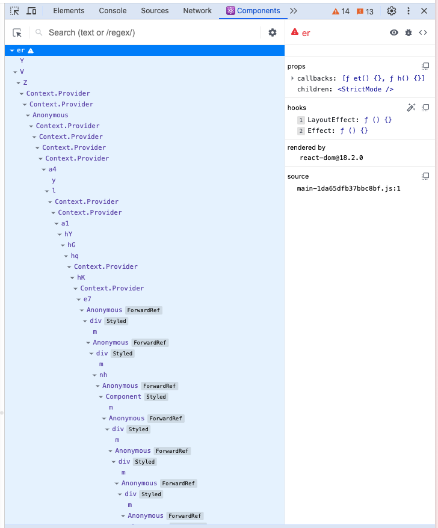

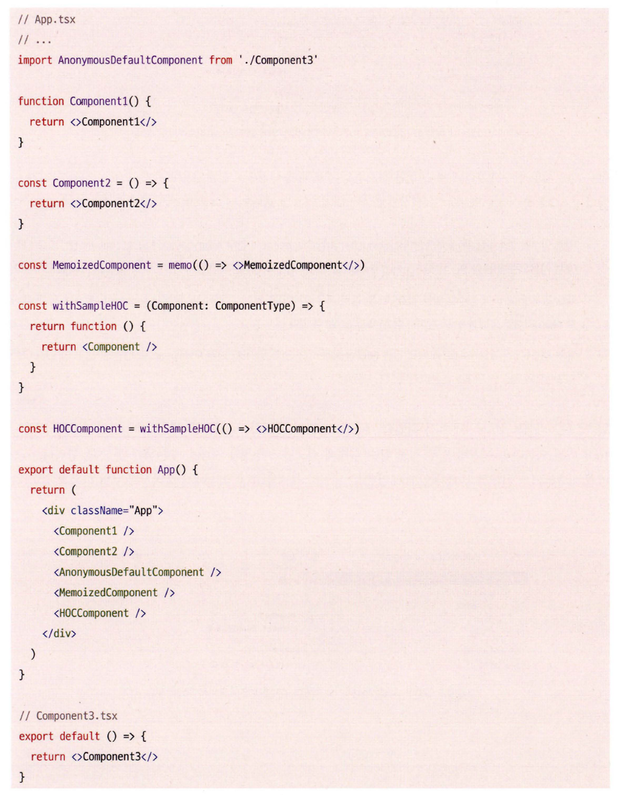

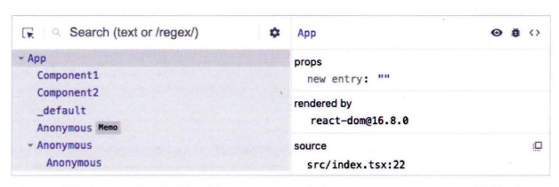

기명 함수로 선언된 컴포넌트는 함수명이 표시된다.

익명 함수로 선언된 컴포넌트는 Anonymous로 표시된다.

memo로 싸여진 함수는 memo 라벨이 표시된다.

고차 컴포넌트도 추론을 제대로 하지 못해서 익명으로 표시되는데, 기명 함수를 만들어서 사용하면 이름을 표시할 수 있다.
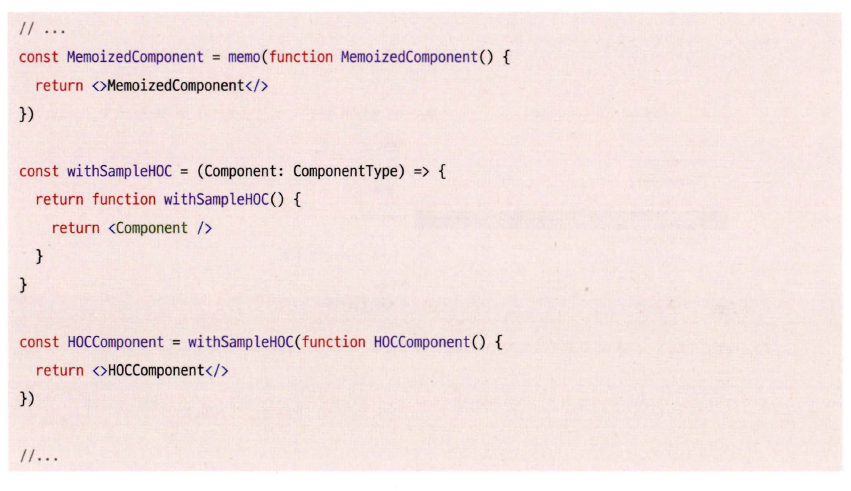

또 다른 방법으로는 displayName을 사용하는 것이다.

```javascript
const MyComponent = () => {
  return <div>MyComponent</div>;
};

MyComponent.displayName = 'MyComponent';
```

구현하다 보면 구조가 복잡해질 때 컴포넌트 이름을 지정해서 개발자 도구에서 확인하면 확실히 디버깅하기에 편해보인다.
이 방법이 없었으면 html class 이용했을 듯

## 컴포넌트명과 Props

### 컴포넌트 명과 Key

컴포넌트 이름과 Key를 볼 수 있다.

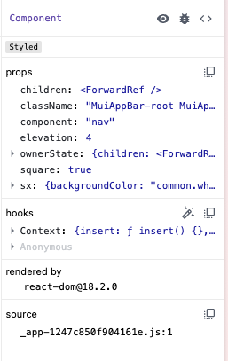

### 컴포넌트 도구

바로 옆에는 컴포넌트 도구가 있다.

* 눈알 버튼은 해당 컴포넌트의 HTML 요소로 바로가기
* 벌레 버튼은 해당 컴포넌트의 정보를 콘솔 로그로 출력
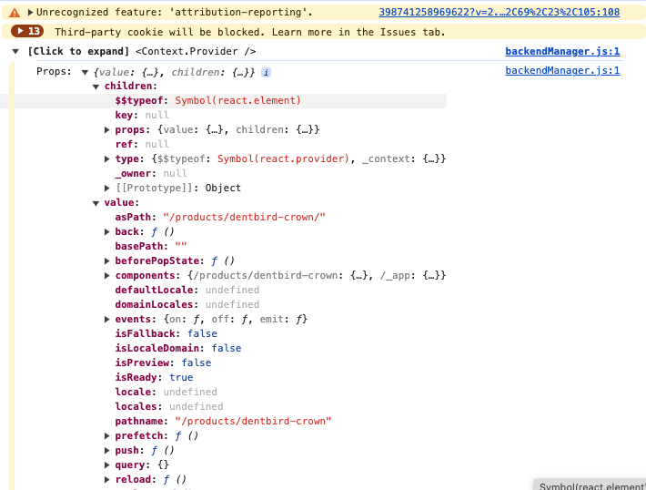
* `<>` 버튼은 소스코드 위치로 이동한다

### 컴포넌트 Props

컴포넌트의 Prop 값과 선언된 위치로 이동 등이 가능하다.

### 컴포넌트 hooks

사용 중인 hook 정보를 확인할 수 있는데 useState에서 use가 생략된 형태로 보여진다.
훅을 기명 함수로 선언하면 더 정확하게 확인할 수 있다.

### rendered by

프로덕션 모드에서는 react-dom의 버전만 확인 가능.  


개발 모드에서는 컴포넌트를 렌더링 한 부모 컴포넌트까지 확인 가능.
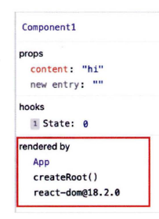

## Profiler

렌더링 과정에서 어떤 컴포넌트가 렌더링 됐고 몇 차례나 렌더링이 일어났으며, 어디에서 오래 걸렸는지 등을 확인할 수 있다.
프로파일러 메뉴는 당연하지만 개발 모드로 실행될 때만 사용 할 수 있다.

몇 가지 주요한 설정이 있다:

* Highlight updates when components render: 컴포넌트가 렌더링 될 때 업데이트된 부분을 강조
* Hide logs dur ing second render in Strict Mode: StrictMode에서 두 번째 렌더링 중 로그를 숨김
* Record why each component rendered while profi ling: 프로파일링 중에 각 컴포넌트가 렌더링된 이유를 기록

### Flamegraph

전체 렌더 과정 중 각 컴포넌트를 렌더링하는데 걸린 시간을 시각적으로 보여준다.

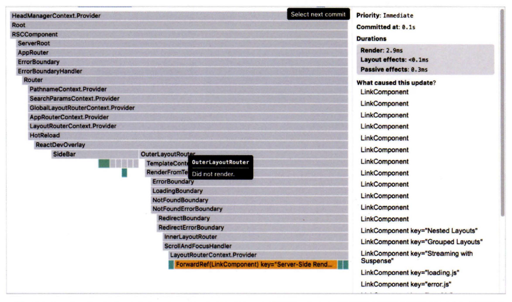
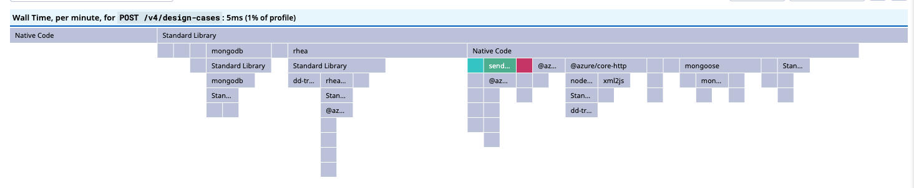

### Ranked

렌더링이 오래 걸린 순서대로 나열된다.

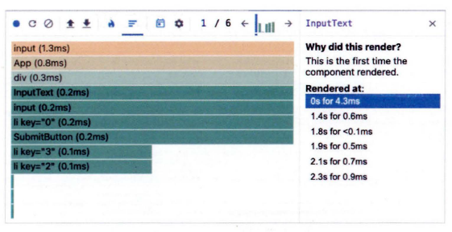

### Timeline

하나의 컴포넌트 내에서 일어난 일들을 시간 순서대로 보여준다.

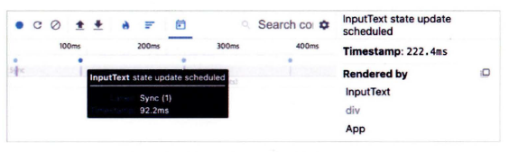
