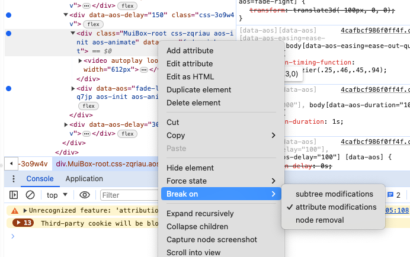
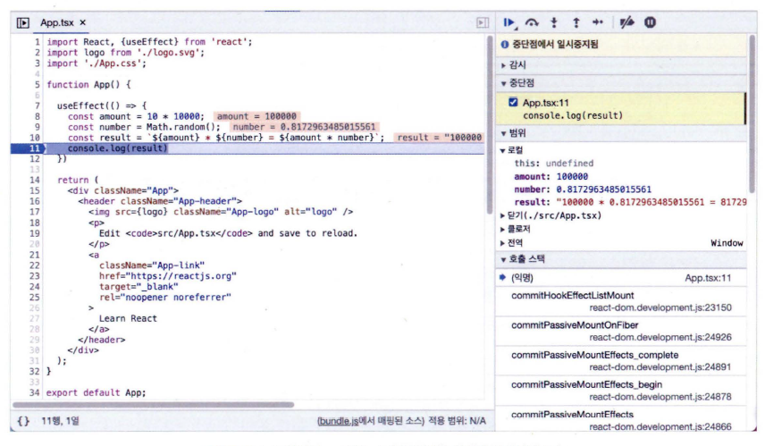
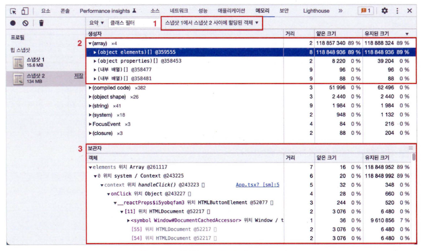
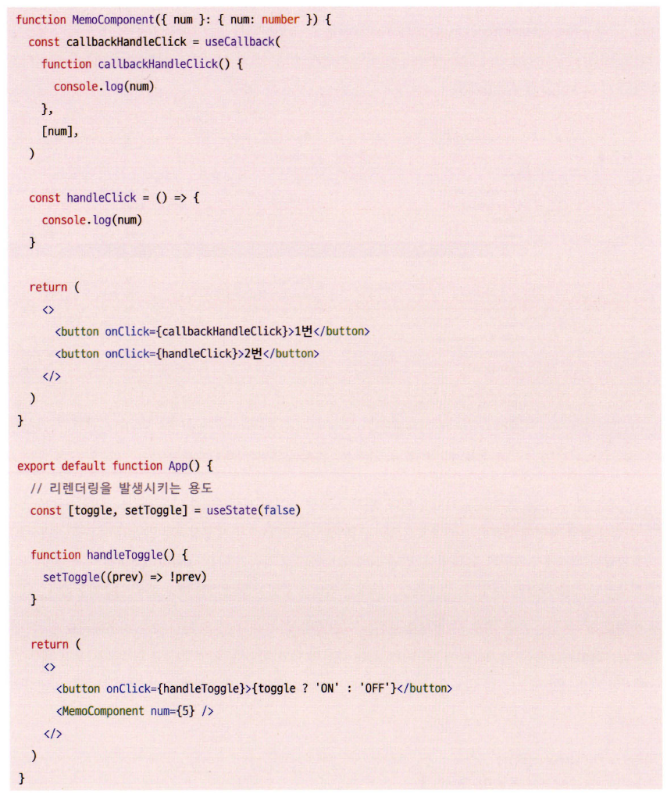
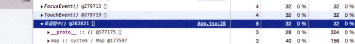
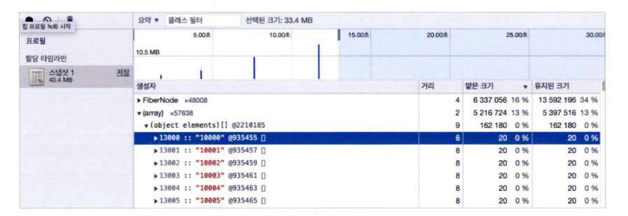
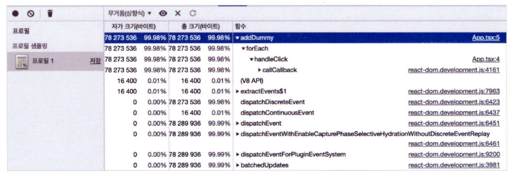
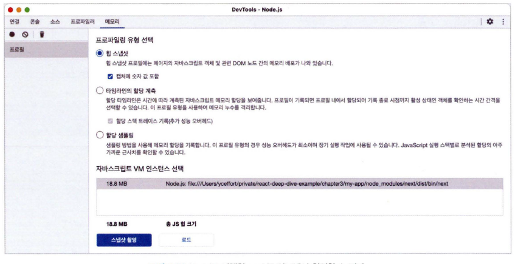
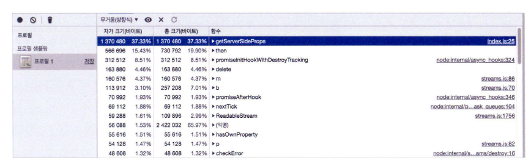

# 크롬 개발자 도구를 활용한 애플리케이션 분석

## 크롬 개발자 도구란?

저자는 확장 프로그램 끄는 걸 추천하는데, 굳이? 라는 생각이 듦.

## 요소 탭

요소 탭은 HTML, CSS 정보를 확인할 수 있다.

중단점 기능이 있는데 이거 전혀 몰랐던 기능이라 원시인 처럼 했었는데 살짝 쇼크...

class 바뀌는 거는 작동을 안 하는데 어떻게 쓰죠?

## 소스 탭

여기서 디버깅이 가능하다.

IDE에는 기본적으로 다 있는 기능이다. (디버거를 잘 활용합시다.)

근데 이쪽 소스는 난독화 때문에 상대적으로 더 어렵긴 한 것 같음.

## 네트워크 탭

웹 개발하면서 가장 많이 열어보는 탭인 듯. 개발자 도구 열면 90%는 이것 때문에 열어보고 있음.

## 메모리 탭

한 번도 써본 적 없는듯. 저자가 어렵다고 하는데 실제로 어려워보였음

* 힙 스냅샷: 현재 메모리 상황을 사진 찍듯 저장하는 것
* 타임라인 할당 계측: 시간의 흐름에 따라 메모리의 변화를 살펴볼 수 있음
* 할당 샘플링: 메모리를 차지하고 있는 자바스크립트 함수를 볼 수 있음

### 힙 스냅샷

#### 얕은 크기와 유지된 크기?

얕은 크기는 객체 자기 자신만의 크기이고 유지된 크기는 해당 객체가 포함하고 있는 다른 객체의 용량까지 포함하는 것.

스냅샷을 활용하여 useMemo나 useCallback 같은 값들이 실제로 유지되는지도 확인할 수 있음. (근데 그 전에 객체 ID로도 확인 했었음)

위의 코드에서 버튼을 클릭하여 App의 렌더링을 유도한 다음의 스냅샷 비교 모습을

중간 중간... 익명 함수`()`는 디버깅할 때 성가심

메모리 덤프 뜰 일이 없어서 몰랐는데 유용한 기능인 듯.

### 타임라인 할당 계측

이름에서 알 수 있듯이 시간의 흐름에 따라 메모리의 변화를 살펴볼 수 있음.

타임라인을 통해서 원하는 범위로 좁혀서 볼 수 있음.

### 할당 샘플링

할당된 메모리 순으로 변수를 정렬할 수 있음. 그리고 그 변수가 만들어진 함수를 확인할 수 있음.

누수가 발생되는 상황을 확인하기 어려워 스냅샷 지점을 못 찾거나 오랜 기간 메모리 누수가 의심되어 프로파일링을 장기간 수행해야 할 경우 할당 샘플링을 활용하는 것이 좋다.

저자는 이렇게 말하는데, 메모리 누수가 발생하고 몇 번 써봐야 알 수 있을 것 같음.
개인적으로는 자바를 사용한 이후로 메모리 누수가 발생한 적은 그리 많지 않았음. (자바로 하면서는로한 번 정도...)
당연히 C 쓸 땐 아주 많았음 ㅋㅋ

## Next.js 환경 디버깅하기

`"dev": NODE_OPTIONS='-i-nspect' next dev` 이 명령으로 디버그 모드로 실행할 수 있다.

근데 왜 IDE에서 안 하고 크롬 개발자 도구로 하는 건지?

아무튼 메모리 탭에서 node 인스턴스를 선택할 수 있음.

트래픽을 지속 유입 시켜서 메모리 변화를 확인할 수 있음.
