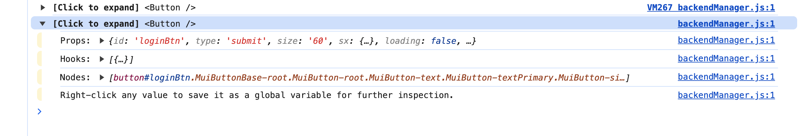
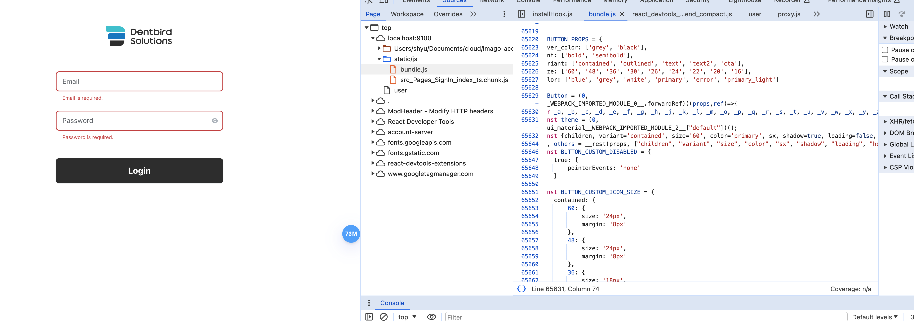
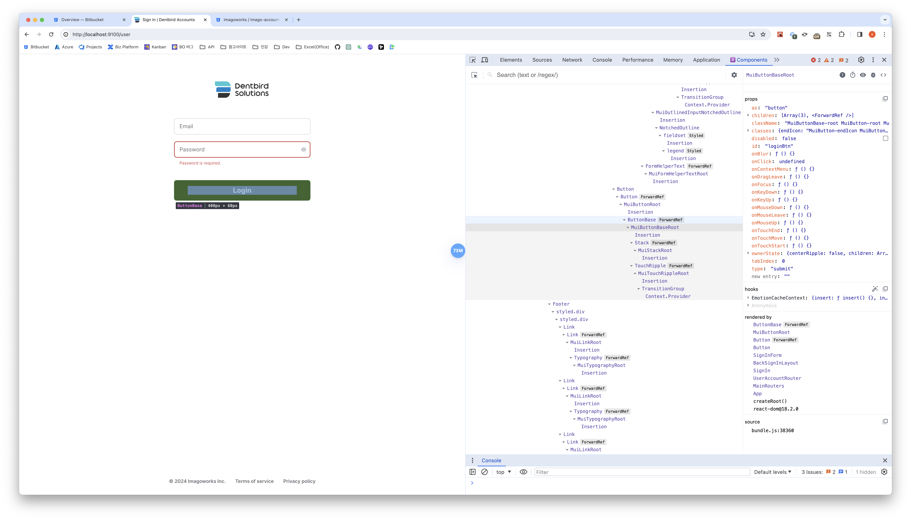
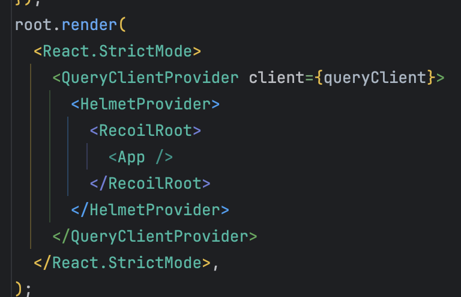
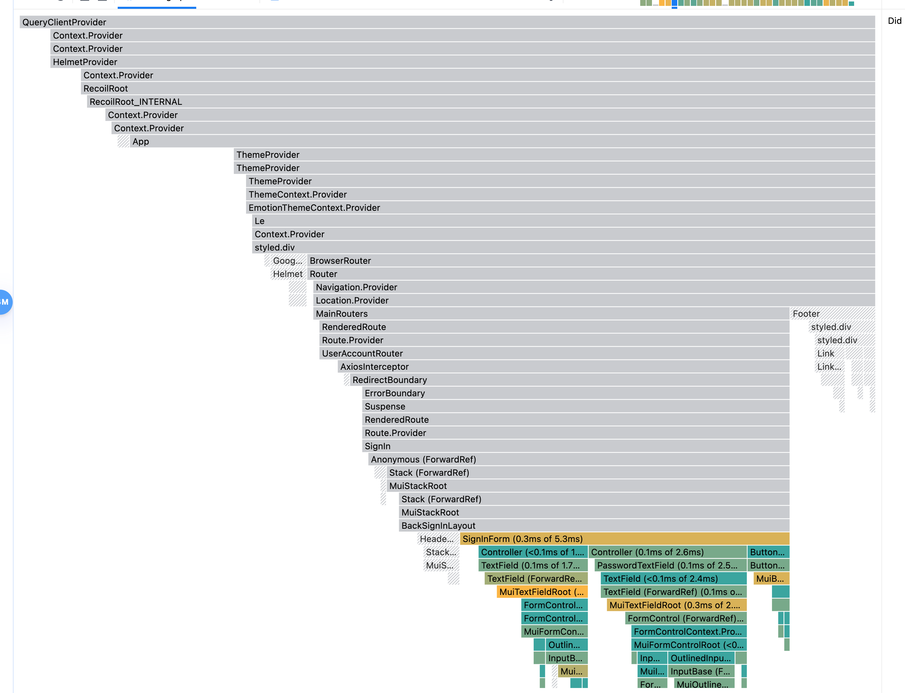
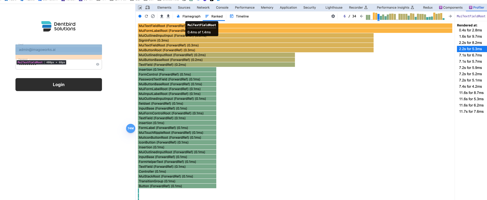
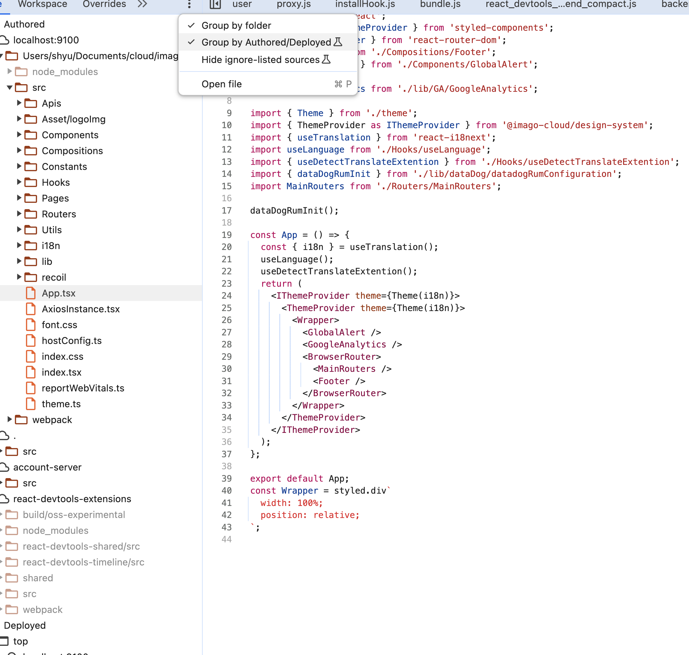

# 🐻 06. 리액트 개발도구로 디버깅하기 & 크롬 개발자 도구를 활용한 애플리케이션 분석

#### 목차

- 6.1 리액트 개발도구란
- 6.2 리액트 개발 도구 설치
- 6.3 리액트 개발도구 활용하기
  - 6.3.1 컴포넌트
  - 6.3.2 프로파일러
- 7.1 크롬 개발자 도구란?
- 7.2 요소 탭
  - 7.2.1 요소 화면
  - 7.2.2 요소 정보
- 7.3 소스 탭
- 7.4 네트워크 탭
- 7.5 메모리 탭
  - 7.5.1 자바스크립트 인스턴스 VM선택
  - 7.5.2 힙 스냅샷
  - 7.5.3 타임라인 할당 계측
  - 7.5.4 할당 샘플링
- 7.6 Next.js 환경 디버깅 하기
  - 7.6.1 Next.js 프로젝트를 디버그 모드로 실행하기
  - 7.6.2 Next.js 서버에 트래픽 유입시키기
  - 7.6.3 Next.js의 메모리 누수 지점 확인하기

## 06. react-dev-tools 살펴보기

리액트 팀이 만들었다.

</img>
깔고 확장 프로그램에서 확인해보자

- 로고 상태 확인
  - 빨간색 : react-dev-tools가 개발자모드로 실행되고 있음
  - 파란색 : 배포되어있는 상태의 페이지(리액트 프로덕션 모드로 빌드되어 실행되었다는 뜻)

하나하나 알아보자
</img>

### Components

리액트 앱 안의 컴포넌트 트리를 나타내 줌. 컴포넌트의 구조, props 내부 hooks 등의 정보 확인 가능.

- 익명함수 Anonymous (\_c3, \_c5 등으로 표현)(v18 이상)
  > - 기명함수로 활용하면 디버깅 쉽게 가능
  > - displayName 속성 추가(개발모드에서만 이용)
- 컴포넌트 트리에서 선택 시, 자세한 내용을 확인해보자

</img>

1. 컴포넌트 명
2. 세가지 아이콘

   - 눈 : HTML의 어디서 렌더링 됐는지 알 수 있음. 클릭하면 해당 element 속성으로 이동
   - 벌레 : 클릭하는 순간 console.log() 찍힘. 해당 컴포넌트가 받는 props, 컴포넌트 내부에서 사용하는 hooks, 해당 컴포넌트의 HTML 요소 nodes가 찍힘.
     </img>

   - <> : 소스코드 확인 가능. 압축된 빌드 형태이니 잘 보이게 하려면 `{}` 아이콘을 클릭해보자.
     </img>

3. Props
   - 해당 컴포넌트가 받은 props 확인 가능
4. hooks
   - use가 생략된 hook(custom hook 포함) 이름을 확인할 수 있음.
5. rendered by
   - 렌더링한 주체를 확인할 수 있음

</img>
</img>

### Profiler

리액트가 렌더링하는 과정에서 발생하는 상황을 확인하기 위한 도구

- 어떤 컴포넌트가 렌더링 됐는지, 몇차례 렌더링 됐는지, 어디서 오래걸렸는지 등
- 개발모드에서만 사용 가능

#### profiler 설정 창

</img>

- General > Highlight updates when components render :
  > 컴포넌트가 렌더링될 때마다 해당 컴포넌트에 하이라이트를 표시. \*꼭 켜둘것.
- Debugging > Hide logs during second render in Strict Mode:
  > 리액트 애플리케이션이 strict 모드에서 실행되는 경우, 원활한 디버깅을 위해 useEffect, console.log 등이 두 번씩 작동한다. 이를 막고 싶다면 해당 버튼을 활성화. 프로덕션 모드에서는 해당 옵션과 관계없이 정상적으로 한 번씩 출력된다.
- Profiler > Record why each component rendered while profiling:

  > 프로파일링 도중 무엇 때문에 컴포넌트가 렌더링됐는지 기록한다. 애플리케이션 속도가 조금 느려질 수는 있지만 디버깅에 도움이 되는 옵션이므로 켜두는 것이 좋다.

- profiling
  > 녹화 시작! 정지!
- Flamegraph
  > 렌더링 되지 않은 컴포넌트는 회색으로 표시됨 
  > 막대 클릭시 `commit information` 에서 업데이트 사유 확인가능
  > </img>
- Ranked
  > 모든 컴포넌트를 보여주는 것이 아닌 렌더링된 컴포넌트만 보여줌
  > </img>
- Timeline

## 07. 크롬 개발자 도구 활용하기

제대로 디버깅 하고싶다면 시크릿 or 프라이빗 모드에서 열자. 확장 프로그램에 의해 제대로 디버깅이 안될 수 있기 때문

### Element

html, css 등 확인가능, hot reloading 없이 UI변화 알 수 있음.

### Source

</img>
Group by Authored/Deployed 누르면 압축되지 않은 폴더 구조 확인 가능. cmd+p로 파일을 찾자

### Network

네트워크 탭에서 체크해봐야 할 것

- 불필요한 요청 또는 중복되는 요청이 없는지
- 웹페이지 구성에 필요한 리소스 크기가 너무 크지 않은지
- 리소스를 불러오는 속도는 적절한지 또는 너무 속도가 오래 걸리는 리소스는 없는지
- 리소스가 올바른 우선순위로 다운로드되어 페이지를 자연스럽게 만들어가는지

### Memory
