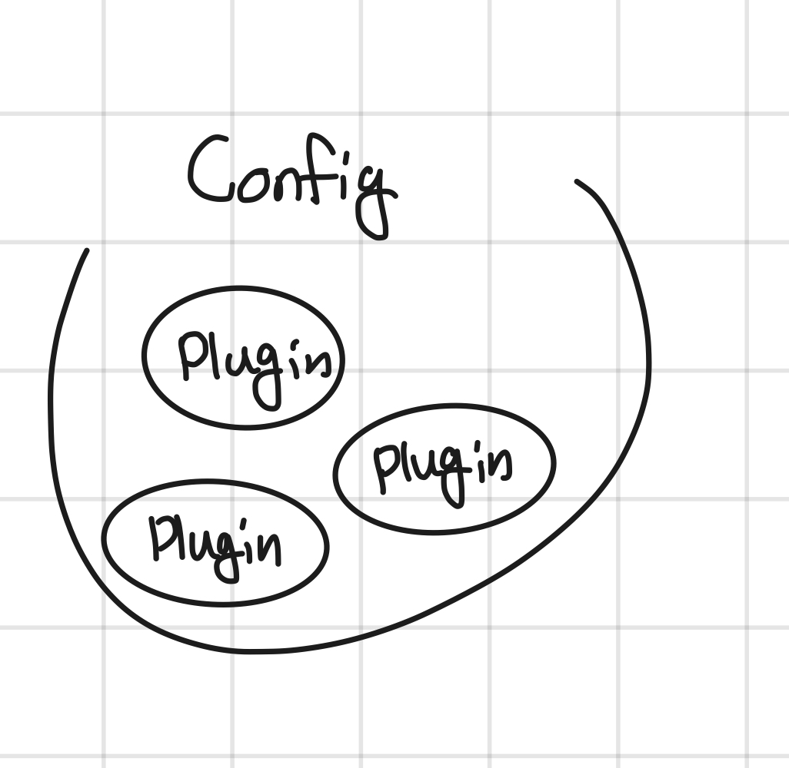
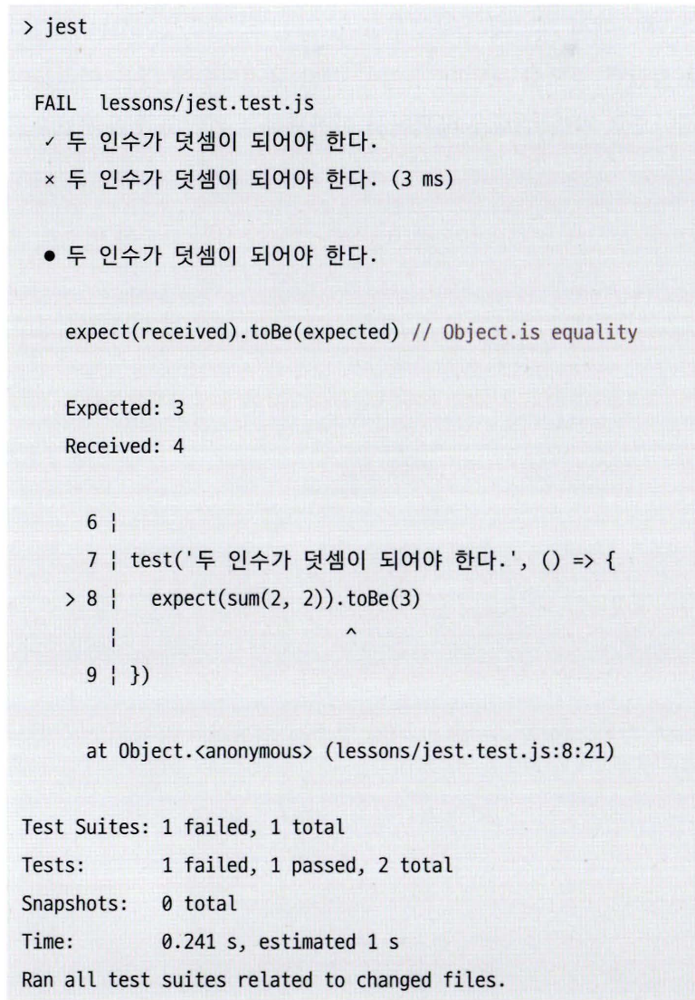

# 🐻 08. 좋은 리액트 코드 작성을 위한 환경 구축하기

#### 목차

- 8.1 ESLint를 활용한 정적 코드 분석
  - 8.1.1 ESLint 살펴보기
  - 8.1.2 eslint-plugin과 eslint-config
  - 8.1.3 나만의 ESLint 규칙 만들기
  - 8.1.4 주의할 점
- 8.2 리액트 팀이 권장하는 리액트 테스트 라이브러리
  - 8.2.1 React Testing Library란?
  - 8.2.2 자바스크립트 테스트의 기초
  - 8.2.3 리액트 컴포넌트 테스트 코드 작성하기
  - 8.2.4 사용자 정의 훅 테스트하기
  - 8.2.5 테스트를 작성하기에 앞서 고려해야 할 점
  - 8.2.6 그밖에 해볼만한 여러가지 테스트

## 8.1 ESLint

ESLint가 코드를 분석하는 방법

1. javaScript 코드를 문자열로 읽는다.
2. \*자바스크립트 코드를 분석할 수 있는 파서parser로 코드를 구조화한다.
3. 2번에서 구조화한 트리를 AST라 하며, 이 구조화된 트리를 각종 규칙과 대조한다.
4. 규칙과 대조했을 때, 위반한 코드를 report or fix한다.

2번 과정인 파서에서 ESLint 는 기본값으로 [espree](https://github.com/eslint/espree)를 사용한다.
espree는 자바스크립트 코드를 JSON형태로 변환한다. 변환된 내용에는 코드의 정확한 위치, 줄바꿈, 들여쓰기 등등을 파악할 정보를 알려준다.

### eslint-plugin & eslint-config

</img>

#### eslint-plugin

특정 프레임워크나 도메인과 관련된 규칙을 모아놓은 패키지들.
ex) eslint-plugin-react

#### eslint-config

eslint-plugin을 한데 묶어서 한세트로 제공하는 패키지. config 다음에 올 단어는 한단어뿐임.

ex) eslint-config-airbnb (가장 대중적), @titicaca/triple-config-kit (국내 트리플에서 개발, airbnb없이 자체적으로 정의한 규칙 적용. 테스트코드가 존재해 추가할 때 확인할 수 있으며, 별도의 front-end 규칙도 제공하고 있어 Node.js환경 & 리액트 환경에 맞는 규칙 적용 가능)

#### prettier 충돌 방지

JS나 TS는 ESLint에 맡기고, 그 외 파일(markdown, YAML, JSON 등)은 Prettier에 맡기자.

## 8.2. 테스트 라이브러리

> - 백엔드 테스트 - 화이트박스 테스트
> - 프론트엔드 테스트 - 블랙박스 테스트

프론트엔드 테스트는 비즈니스 로직 고려해야 하며, 사용자는 개발자의 의도대로만 사용하지 않기 때문에 모든 경우의 수를 고려해야 한다.
사용자의 인터렉션 + 브라우저에서 발생할 수 있는 시나리오를 고려해야 한다.

#### 테스트 코드를 작성하는 과정

1. 테스트할 함수나 모듈을 선정한다.
2. 함수나 모듈이 반환하길 기대하는 값을 적는다.
3. 함수나 모듈의 실제 반환값을 적는다.
4. 3번의 기대에따라 2번의 결과가 일치하는지 확인한다.
5. 기대하는 결과를 반환한다면 테스트는 성공이며, 만약 기대와 다른 결과를 반환한다면 에러를 던진다.

- Node.js에서는 assert라는 모듈을 기본적으로 제공한다.

```js
const assert = require("assert");

function sum(a, b) {
  return a + b;
}

assert.equal(sum(l, 2), 3);
assert.equal(sum(2, 2), 4);
assert.equal(sum(l, 2), 4); // AssertionError [ERR_ASSERTION [ERROR_ASSERTION]: 3 == 4
```

이렇게 사용함.

테스팅 프레임워크
위의 어설션을 기반으로 테스트를 수행한다. JS에서 유명한 테스팅 프레임워크는 Jest, Mocha, Karma, Jasmine 등이 있고, 이 장에서는 Jest 를 배워본다.

```js
//math.test.js

const { sum } = require("./math");

test("두 인수가 덛셈이 되어야 한다.", () => {
  expect(sum(1, 2)).toBe(3);
});

test("두 인수가 덛셈이 되어야 한다.", () => {
  expect(sum(1, 2)).toBe(4); // error!
});
```

`npm run test`로 돌려보면 실행 결과를 알 수 있다.

</img>
뭐 이런,,

여기서 사용되는 메서드 `test`, `expect`를 import없이 불러올 수 있는걸 볼 수 있는데, Jest CLI라 해서 실행 시에 전역 스코프에 값들을 넣어주기 때문.

#### 리액트 컴포넌트 테스트 방법

1. 컴포넌트를 렌더링 한다.
2. (optional) 컴포넌트에서 특정 액션을 수행한다.
3. 컴포넌트 렌더링과 2번의 액션을 통해 기대하는 결과와 실제 결과를 비교한다.

ex)

```jsx
import React from 'react';
import { render, screen } from '@testing-library/react'
import App from './App'

test ('renders learn react link', () => {
render(<App />)  // 1. App을 렌더링한다.
canst linkElement = screen.getByText (/learn react/i)
// 2.렌더링하는 컴포넌트 내부에서 'learn react'라는 문자열을 가진 DOM요소를 찾는다.
expect(linkElement).toBelnTheDocument() // 3.어설션을 활용해 2번에서 찾은 요소가 document 내부에 있는지 확인한다.
})
```

HTML요소가 있는지 확인하는 방법

- getBy...
- findBy...
- queryBy...

테스트 파일은 테스트할 파일과 같은 위치에 있는것이 일반적, 테스트 파일은 번들링에서 제외됨

```
ㄴ App.tsx
ㄴ App.test.tsx
```

#### 정적 컴포넌트를 테스트 할 때 쓰이는 메서드

- beforeEach
- describe
- it
- testId

#### 동적 컴포넌트

정적컴포넌트와의 차이점

- setup 함수:
- 사용자 작동을 흉내내는 메서드
  - type
  - click
  - dbclick
  - clear

#### 비동기 이벤트가 발생하는 컴포넌트

- MSW를 사용한다. <- 모킹 라이브러리로, 브라우저에서 서비스 워커를 활용해 실제 네트워크 요청을 가로채는 방식으로 모킹을 구현한다.
  Node.js 환경에서는 https나 XMLHttpRequest의 요청을 가로채는 방식으로 작동한다.

#### custom hook 테스트하기

### 테스트를 작성하기에 앞서..

테스트 커버리지를 높이는것이 만능은 아니다. 테스트코드를 작성하기 전에 생각해봐야 할 것은 '애플리케이션에서 가장 취약하거나 중요한 부분을 파악'하는 것이다.
애플리케이션에서 가장 핵심이 되는 부분부터 테스트코드를 작성해나가라.

테스트가 이뤄야 할 목표는 '애플리케이션이 비즈니스 요구사항을 충족하는지 확인' 하는것이다.
