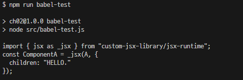
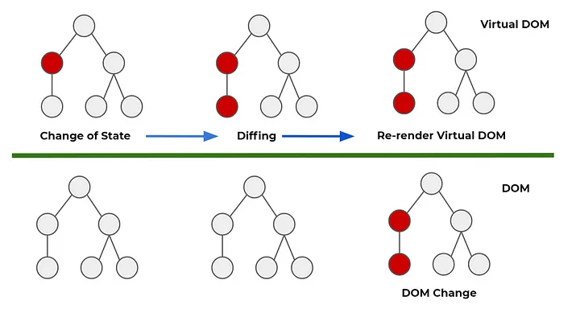
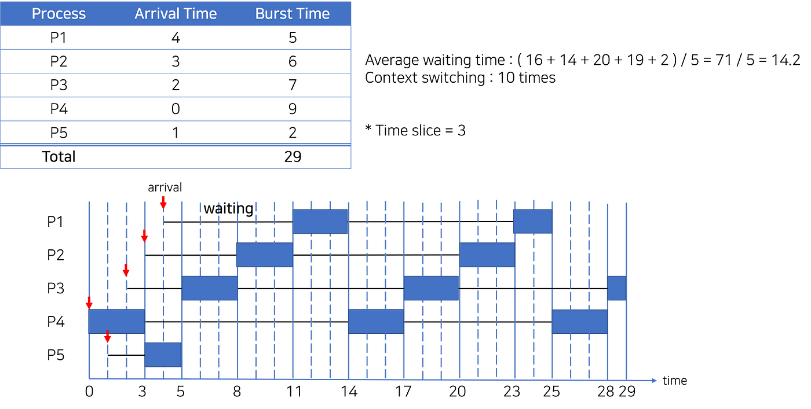
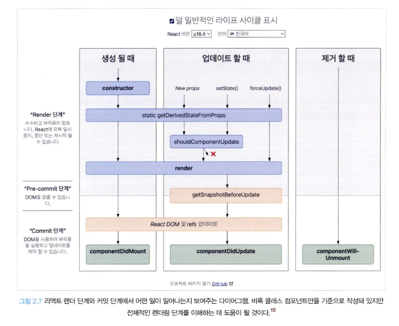

# Chapter 02 - React Core

---

# 개요

저는 사실 예전에 한번 Fiber를 살짝 맛 본적이 있습니다.

그래서 조금 더 이야기 하고 싶은 부분이 많았습니다.

과감하게 오늘 날에는 살짝 힘을 덜 줘야할 것 같은 내용은 제쳐두고

자칫 책만 보고 따라가기에는 의문점이 많이 남을 만한 곳들을 저만의 스타일로 좀 긁어보는 정리를 해보려 합니다.

(중간에 먼길 돈다는 뜻)

---

# 1. JSX ?

JSX ( Javascript XML 혹은 JavaScript Syntax eXtension)는 XML과 유사한 구문을 사용하며, **DOM 트리를 생성** 할 수 있는 JavaScript의 확장 표현 _(XML은 eXtensible Markup Language, 확장 가능한 마크업 언어)_ 이라고 위키백과에 적혀져있다.

**_하지만, 사실은 조금 다르다._**

[facebook 공식 JSX 사양 링크](https://facebook.github.io/jsx/)

JSX는 Facebook이 제안하였으며, XML과 유사한 것은 HTML 형태로 마크업 하는 것(~~코?딩?~~)이 친숙하니 형태를 유지한 것으로 보인다.

위의 사양 소개를 보면, JSX 구문은 결국 ECMAScript로 변환하는 것을 목표로 한다.

ECMAScript로 변환하면, 누가 ? HTML로 변환할 것인가 ? -> 이 역할은 React가 해준다.

React는 JSX로 정의한 구문을 Compile하여 React 객체를 만들어주는 React.createElement(...) 를 반환하도록 한다.

> _(그럼 이건 누가 변환해서 브라우저 호환을 시켜주나요 ? => Babel, SWC 등등..의 역할)_

React.createElement()는? React에서 사용하는 객체로 만들어준다. 이건 뒤 이어서 나올 챕터에서 더 자세하게 다룰 것으로 보인다.

### 정리

위 내용을 정리하면 React를 사용할 때 DOM 트리를 생성하는 것은 React가 하는 것이며, JSX는 표현의 영역만을 담당한다.

---

# 2. JSX Component

JSX는 기본적으로 `JSXElement`, `JSXAttributes`, `JSXChildren`, `JSXString` 라는 4가지 컴포넌트를 기반으로 구성되어 있다.

### JSXElement

JSX를 구성하는 가장 기본적인 요소이며, HTML Element와 유사한 역할을 한다.
JSXElement를 구성하는 컴포넌트들도 존재하는데, 아래 표현 방법에서 각각 어떤 것을 의미하는지 적어보았다.

```JavaScript
EX) Test 컴포넌트 정의 할때의 각 JSX 요소들 (부가적으로 Another, Member 와 같은 컴포넌트 명도 사용)

Test - JSXIdentifier, 컴포넌트 식별자
<Test> - JSXOpeningElement
</Test> - JSXClosingElement
<Test> </Test> - JSXOpeningElement JSXClosingElement
<Test/> - JSXSelfClosingElement
<><> - JSXFragment 표현

JSXNamespacedName (<foo:bar></foo:bar>), JSXMemberExpression(<foo.bar></foo.bar>) 와 같은 형태도 있음
아래는 간단 예제

import Components from 'Components';
// import {Button} from 'Components';
function App() {

    return (
        <>

            <Components:Button></Components:Button> - JSXNamespacedName (JSXIdentifier:JSXIdentifier)
            <Components.Button></Components.Button> - JSXMemberExpression (JSXIdentifier.JSXIdentifier)
        </>
    )
}

```

### JSXAttributes

JSXElement에 부여할 수 있는 속성을 의미하며, Optional 하다
JSXSpreadAttributes, JSXAttribute, JSXAttributeName 등으로 구성된다.

```JavaScript
여기 또한 Test Component로...

props = {
    name : "yeonho"
}

JSXSpreadAttributes - <Test {...props}/>
JSXAttribute - <Test name="yeonho2">  여기서 name은 JSXAttributeName, "yeonho2" 는 JSXAttibuteValue

JSXAttributeName : JSXIdentifier JSXNamespacedName
JSXAttributeValue : "", '', {AssignMentExpression}, JSXElement, JSXFragment 사용가능

JSXAttributeValue가 JSXElement를 갖는 경우가 뭔가요?

function Parent({children}) {   /* react context api 등에서 활용 */
    return <div>{children}</div>
}

export default function App() {
    return (
        <div>
            <Parent attribute={<div>Test</div>}/>
        </div>
    )
}

```

### JSXChildren

JSXElement 안에서 표현할 수 있는 자식을 표현하는 것을 JSXChildren이라 한다.
JSXChildren 안에는 여러 개(없을 수도 있음)의 JSXChild로 구성된다.

```JavaScript

<Test> Hello {namelist.map((name : string) => <NameComponent name/>)}</Test>

JSXChild : JSXText, JSXElement, JSXFragment, {JSXChildExpression} 로 구성될 수 있다.
```

### JSXString

JSXElement에서 표현하는 String을 의미한다.
JS와 다른 점이라면, JS에서의 String 시 `\n` `\r`와 같은 특수한 역할을 하는 이스케이프 문자 형태가 있는데, JS에서는 string에 `let i = "\"` 을 선언하면 SyntaxError가 발생하여 `let i = "\\"` 와 같이 표현해야지만 `\`가 표현이 된다.
하지만 JSX안에서는 그냥 표현이 가능하다. `<Test>\</Test>`
여기서 JSXIdentifier 같은 경우도 `<await/>` 과 같은 컴포넌트명을 사용할 수 있다. JS에서의 예약된 키워드랑 별개이기 때문이다.

---

위 내용은 https://facebook.github.io/jsx/ 에서 확인하면 더 좋을 것이다.

# 3. JSX To ECMAScript

Babel을 사용해서 JSX로 구성한 React Component가 결국 무엇으로 변환되는 지 확인해보자.
이 코드는 src/babel-test.js 에서 구현될 것이다.

`npm run babel-test` 로 실행 가능하도록 구성하였다.

```JavaScript
const Babel = require("@babel/standalone");
Babel.registerPlugin("@babel/plugin-transform-react-jsx", require("@babel/plugin-transform-react-jsx"));

const BABEL_CONFIG = {
  presets: [],
  plugins: [
    [
      "@babel/plugin-transform-react-jsx",
      {
        throwIfNamespace: false,
        runtime: "automatic",
        importSource: "custom-jsx-library",
      },
    ],
  ],
};

const SOURCE_CODE = `const ComponentA = <A>HELLO.</A>`;

const { code } = Babel.transform(SOURCE_CODE, BABEL_CONFIG);

console.log(code);
```

**결과 화면**



## React는 어떻게 나올까..?

책에 있는 구성을 통해서 해보려 하였으나, 정확한 `@babel` 에 대한 설정에 대한 설명이 부실하여.. 나름 검색을 해서 구성해보았다.

필요한 패키지는 `@babel/core, @babel/preset-env, @babel/preset-react` 이며 cli 사용을 위해 `@babel/cli` 를 추가적으로 설치하였다.

아래는 .babelrc 파일이다.

```
{
  "presets": ["@babel/preset-env", "@babel/preset-react"]
}
```

package.json 파일 내용이다.

```
{
  "name": "ch02",
  "version": "1.0.0",
  "description": "---",
  "main": "src/index.js",
  "scripts": {
    "test": "echo \"Error: no test specified\" && exit 1",
    "babel-test": "node src/babel-test.js",
    "react-test": "babel src/react-test.js -o dist/react-test.js"
  },
  "author": "",
  "license": "ISC",
  "dependencies": {
    "@babel/core": "7.24.0",
    "@babel/plugin-transform-react-jsx": "7.23.4",
    "@babel/preset-env": "7.24.0",
    "@babel/preset-react": "7.23.3",
    "@babel/standalone": "7.24.0",
    "@babel/cli": "7.24.0"
  }
}
```

`npm run react-test` 를 실행하면 dist/react-test.js로 변환된 코드가 나온 것을 볼 수 있다.

```JavaScript
/** 간단한 React 코드 변환을 위함 */
function TestComponent() {
  return <span> React </span>;
}

function MyComponent() {
  return (
    <h1>
      <TestComponent /> 컴포넌트로 변해라!
    </h1>
  );
}


/* 위 코드는 아래와 같이 변환 됩니다. */

"use strict";

/** 간단한 React 코드 변환을 위함 */
function TestComponent() {
  return /*#__PURE__*/React.createElement("span", null, " React ");
}
function MyComponent() {
  return /*#__PURE__*/React.createElement("h1", null, /*#__PURE__*/React.createElement(TestComponent, null), " \uCEF4\uD3EC\uB10C\uD2B8\uB85C \uBCC0\uD574\uB77C!");
}


```

결과를 보면 React.createElement()를 호출하며 인자로 처음에 구성한 내용들이 들어간 것을 볼 수 있다.
React.createElement()는 무엇을 하는걸까?

---

# React.createElement() ?

[React 공식 - React.createElement](https://ko.react.dev/reference/react/createElement)

`createElement(type, props, ...children)` 은 인수를 비롯하여 React Element **객체**를 생성한다.

아래는 createElement를 다시 JSX 문법으로 변환 해본 예다.

```JavaScript

import { createElement } from 'react';

function Greeting({ name }) {
  return createElement(
    'h1',
    { className: 'greeting' },
    'Hello'
  );
}

// 이를 JSX 표현으로 다시 바꿔보면

function Greeting({name}) {
    return <h1 className={"greeting"}>Hello</h1>
}
```

#### createElement 매개변수

**_type_** : 유효한 React Component여야 한다. HTML 태그, Fragment도 가능하다.
**_props_** : 객체 또는 null 이어야 한다. (빈 객체와 null은 동일하게 처리된다.) `React`는 전달한 props와 일치하는 프로퍼티를 가진 엘리먼트를 생성한다. 전달한 props 객체의 `ref`와 `key`는 특수하기에 props를 통한 접근이 불가하다.
접근하려면 `element.ref, element.key` 와 같이 element에서 직접 접근해야한다.
**_...children_** : optional 하며, React Element, 문자열, 숫자, portal, 빈 노드(null, undefined, true, false) 그리고 React Node Array를 포함한 모든 React Node가 될 수 있다. (React Node는 가장 기본적인 단위이다. React Element도 React Node에 포함된다.)

#### createElement 반환값

**_tpye_** : 전달받은 type
**_props_** : ref와 key를 제외한 전달받은 props. type이 type.defaultProps를 가지는 컴포넌트라면, 누락되거나 정의되지 않은 props는 type.defaultProps의 값을 가져온다. (요즘 함수형에 익숙해져서 잘 모르겠지만 class 형태로 컴포넌트를 만들 때는 defaultProps를 따로 설정해줬었다.)
**_ref_** : 전달받은 ref, 누락된다면 null
**_key_** : 전달받은 key를 강제로 문자열로 변환시킨 값, 누락되었다면 null

### 주의 사항

- 반드시 ** React 엘리먼트와 프로퍼티는 불변하게 취급 ** 해야 한다. (직접적으로 변경하면 안된다.) React는 이를 강제하기 위해 엘리먼트와 프로퍼티를 얕게 freeze 한다. _(DOM Element에서 react element를 찾아내서 props를 변경하지 말라는 의미)_

- JSX를 사용한다면 컴포넌트의 명은 무조건 대문자이다. 이유는 JSX 문법을 createElement로 변환시 아래와 같이 변환되기 때문이다.

```JavaScript
<Something/> = > createElement(Something)
<something/> => createElement('something') // XXXXXXXXXXXXXX
```

- `createElement('h1', {}, child1, child2, child3)` 과 같이 호출할 경우 child가 모두 정적이어야 한다. 어지간한 동적인 컴포넌트들이라면 []를 통해 spread로 전달해야한다. 그냥 넣으면 컴포넌트 업데이트가 일어나지 않음

### 그래서 결국 React.createElement()가 생성하는 객체가 어떻게 생긴건데 ?

```JavaScript
<Greeting name="yeonho"/> // 는 아래와 같이 변환된다.
React.createElement(Greeting, { name : 'Taylor' }) // 이 함수를 호출하면 아래와 같은 객체가 반환된다.
// 약간 단순화 됨
{
    type : Greeting,
    props : {
        name : 'Taylor'
    },
    key : null,
    ref : null
}

```

엥 근데 이 객체 생성해서 뭐하는거죠?

> 이 객체를 생성해도 컴포넌트가 `DOM Element`로 바로 생성이 되는 것은 아니다.

> `React`는 이렇게 만들어진 엘리먼트를 나중에 렌더링하도록 지시하기 위해 위와 같은 객체로 미리 변환을 해두는 것이다.

> 최종적으로 `App` 컴포넌트에서 위와 같은 객체를 반환함으로서 React가 다음에 할 일을 실행(렌더링 할 준비)한다.

> 엘리먼트 생성 비용은 매우 저렴한 편이니 생성을 최적화 하거나 피하려고 노력할 필요 없다 -> **_컴포넌트를 나눠서 작성해도 큰 비용이 들지 않음, React에서 Atomic Pattern이 왜 유리한지 알 수 있다._**

---

# Virtual DOM ...?

과거의 웹 페이지는 _(최소... 2015년 이전)_ 정적인 모습을 많이 보였다.

하나의 서비스는 정적인 여러 페이지로 구성이 되었고, 각 페이지는 미리 구성된 데이터만을 표현하는 경우가 많았다.

이를 MPA(Multi Page Application) 이라 하며, 과거 Virtual DOM이 없을 때는 원본 DOM을 직접적으로 건드리는 경우가 많았기 때문에 SPA(Single Page Application) 형태로 개발을 하려면 많은 변수가 존재했었다.

React는 Facebook 팀이 Facebook을 더 잘 만들기 위해 만든 View에 집중한 JavaScript UI Library 이다.

그래서 왜 Facebook 팀이 React를 만들었을까? 를 생각해보면 React를 이해하는 데 조금 더 좋은 영향이 있을 것이라 생각한다.

Facebook은 SPA 형태를 가지고 있으며, 계속해서 News Feed에 나의 친구들이 올린 포스트가 업데이트 되고, 스크롤을 내리면 내릴 수록 새로운 컨텐츠가 그려져야했었다.

하지만, 새로운 컨텐츠가 추가될때마다 혹은 사용자가 어떠한 액션을 취할 때 마다 시시각각 변하는 View를 구현하는데 직접적으로 DOM을 건드리는 것은 너무나 많은 Side Effect가 예상되었을 것이다.

여기에 더해, 사용자가 더 많은 컨텐츠를 불러올 수록 (스크롤을 미친듯이 내릴수록) 페이지는 더욱 무거워졌을 것이고 이는 곧 처음과 다르게 DOM 업데이트 속도가 느려질 것이라 예상한다. 이렇게 되면 UX 적으로도 좋은 경험은 아닐 것이고 결국 사용자들은 Facebook이 느려졌으니 앱을 종료할 것이다.

Facebook의 서비스 목표는 더 많은 사용자가 더 많은 컨텐츠를 보고 앱에서 이탈하지 않는 것이라 예상한다.



Facebook이 내놓은 방법으로는 Virtual DOM을 통해 원본 DOM 대신 Update 하는 것이었다.
각 UI 컴포넌트에 State를 부여하여 State가 변하게 된다면 Virtual DOM를 통해 컴포넌트 업데이트(re-render)를 발생하게 하였다.

이후 Update가 이루어진 Virtual DOM 부분을 원본 DOM에서 바꿔치기한다.

이렇게 되면 원본 DOM을 직접적으로 접근하여 Side Effect가 발생할 것을 줄일 수 있었고, State가 바뀐 부분만 다시 그려주면 되었기 때문에 규모가 커질 수록 상대적인 성능이 향상 될 것이었다.

실제로 React가 출시되고 나서 Web 서비스들의 퀄리티는 매우 높아졌다. 하지만, 문제가 발생한다.
Virtual DOM을 사용하던 React 16 이전에는 State가 변경될 때마다 Virtual DOM을 통해 업데이트하는 구조였다.
100개의 State가 한번에 Update 될 경우 Virtual DOM을 통해 Update 하는 과정이 100번 한다는 소리였다.

문제가 있었다.

컴포넌트는 각각의 State를 가지고 있었고 부모 컴포넌트로 인해 자식 컴포넌트 업데이트가 이뤄지게 된다면 이에따른 Update 과정은 엄청나게 잦았을 것으로 보인다.

눈으로 한번 봐보자. [React 15, Sierpinski Triangle](https://claudiopro.github.io/react-fiber-vs-stack-demo/stack.html)

Update로 인해 프레임이 엄청 떨어지는 것을 볼 수 있다.

오늘 날의 React는 이렇게 되진 않을 것이다.
React 16버전 이후 적용된 Fiber가 적용되었을 때는 어떨까?
[React 16, Sierpinski Triangle](https://claudiopro.github.io/react-fiber-vs-stack-demo/fiber.html)

엄청난 성능적 상향이 이뤄진 것일까? Fiber가 적용된 예제를 보았을 때는 속도차이가 어마어마 해보인다.

확실한건, React는 예전부터 Vanilla.js 보다는 느렸다.
그리고 React 15와 현재의 React의 속도적인 부분의 차이는 크게 없다.

Fiber는 대체 무엇일까? Facebook React는 또 어떤 마법을 부려서 이를 고쳐냈을까?

---

# React Fiber

#####개발적인 퍼포먼스와 유저가 느끼는 퍼포먼스는 같은가?

개발적인 퍼포먼스는 결국 태스크가 수행되는 시간이 짧을 수록 퍼포먼스가 좋은 것일 것이다.

하지만, **_과연 유저가 느끼는 퍼포먼스도 이와 동일한가?_**

이 부분을 먼저 생각하고 **React**를 바라 본다면 좋을 것 같다.

리액트 파이버(React Fiber)는 리액트에서 관리하는 **_평범한 자바스크립트 객체_** 이다. 파이버를 관리하는 것은 파이버 재조정자(Fiber Reconciler)가 관리한다.

이때 파이버와 파이버 노드(Fiber Node)는 같은 의미이며, 파이버 재조정자는 파이버 노드를 가지고 리액트를 사용한 웹 애플리케이션에서 발생하는 애니메이션, 레이아웃, 인터렉션 등에 대한 **_올바른 결과물을 만들 수 있도록 조정하는 역할_**을 한다.

그래서 파이버라 불리는 React의 새로운 알고리즘의 재조정 기능(Reconciliation)은 아래와 같은 일을 할 수 있도록 한다.

> - 작업을 작은 단위로 분할하고 쪼갠 다음, 우선순위를 매긴다.
> - 이러한 작업을 일시 중지하고 나중에 다시 시작할 수 있다.
> - 이전에 했던 작업을 다시 재사용하거나 필요하지 않은 경우에는 폐기할 수 있다.

**_엥 이거 완전 스케쥴러 아닌가?_**



위와 같은 작업을 가지는 것을 **동시성(Concurrency)**을 가진다고 하며, **_여러 작업들이 동시에 처리 되는 것처럼!!_** 처리하는 것을 의미한다.

React에서 위의 과정을 수행할 때는 비동기적으로 일어난다. 그렇다면 내가 지금 setState를 통해 state를 업데이트 할 때마다 바로 반영이 되지 않을 것이다. (Automatic Batching)

과거 리액트의 조정 알고리즘은 스택을 기반으로 하였다. 이때는 스택에 Rendering에 관련된 작업이 쌓이면 이 스택이 빌때까지 **_동기적_** 으로 작업이 이루어졌다.

JS는 싱글 스레드이기 때문에, 이 동기 작업은 중간에 바뀔 수 없었다. 탭이 꺼지지 않는 이상...

이에 대한 문제는 사용자 인터랙션에 따른 동시 다발적인 이벤트, 애니메이션 등을 처리할 때 육안으로 확인할 수 있는 문제를 발생시켰으며 개발자는 이를 막기위한 추가적인 코드를 작성했어야 했다.

시대가 변하며, 위와 같은 인터렉션을 요구하는 작업은 어떤 플랫폼이던지 필수 불가결인 요소가 되어가고 있었고, React는 위와 같은 비효율적인 요소를 개선하기 위해 Fiber를 내놓은 것이다.

파이버는 위에서 잠깐 설명한 조정 단계를 Commit Phase 이라 칭한다. 그리고 DOM에 변경사항을 반영하는 것은 Render Phase에서 진행하게 된다. 이부분은 뒤에서 조금 더 자세하게 다룰 것이다.

실제 파이버의 객체는 어떻게 구성되어있는지 확인해보자

[github - react/package/react-reconciler](https://github.com/facebook/react/blob/main/packages/react-reconciler/src/ReactFiberReconciler.js)

```JavaScript

function FiberNode(
  this: $FlowFixMe,
  tag: WorkTag,
  pendingProps: mixed,
  key: null | string,
  mode: TypeOfMode,
) {
  // Instance
  this.tag = tag;
  this.key = key;
  this.elementType = null;
  this.type = null;
  this.stateNode = null;

  // Fiber
  this.return = null;
  this.child = null;
  this.sibling = null;
  this.index = 0;

  this.ref = null;
  this.refCleanup = null;

  this.pendingProps = pendingProps;
  this.memoizedProps = null;
  this.updateQueue = null;
  this.memoizedState = null;
  this.dependencies = null;

  this.mode = mode;

  // Effects
  this.flags = NoFlags;
  this.subtreeFlags = NoFlags;
  this.deletions = null;

  this.lanes = NoLanes;
  this.childLanes = NoLanes;

  this.alternate = null;

  if (enableProfilerTimer) {    // Profiler 녹화 활성화 시 성능 문제가 있어 처음 NaN으로 선언하여 정수형을 정의를 회피
    // Note: The following is done to avoid a v8 performance cliff.
    //
    // Initializing the fields below to smis and later updating them with
    // double values will cause Fibers to end up having separate shapes.
    // This behavior/bug has something to do with Object.preventExtension().
    // Fortunately this only impacts DEV builds.
    // Unfortunately it makes React unusably slow for some applications.
    // To work around this, initialize the fields below with doubles.
    //
    // Learn more about this here:
    // https://github.com/facebook/react/issues/14365
    // https://bugs.chromium.org/p/v8/issues/detail?id=8538
    this.actualDuration = Number.NaN;
    this.actualStartTime = Number.NaN;
    this.selfBaseDuration = Number.NaN;
    this.treeBaseDuration = Number.NaN;

    // 다시 정수를 대입
    // It's okay to replace the initial doubles with smis after initialization.
    // This won't trigger the performance cliff mentioned above,
    // and it simplifies other profiler code (including DevTools).
    this.actualDuration = 0;
    this.actualStartTime = -1;
    this.selfBaseDuration = 0;
    this.treeBaseDuration = 0;
  }

  if (__DEV__) {    //dev 환경
    // This isn't directly used but is handy for debugging internals:
    this._debugInfo = null;
    this._debugOwner = null;
    this._debugNeedsRemount = false;
    this._debugHookTypes = null;
    if (!hasBadMapPolyfill && typeof Object.preventExtensions === 'function') {
      Object.preventExtensions(this);
    }
  }
}

```

위의 FiberNode를 직접적으로 할당하는 과정에서는 `createFiber()` 를 통해서 진행하며, 어떤 것에서 비롯되었는지에 따라 `createFiber()` 함수를 호출하는 또 다른 함수들이 존재한다.
책에서는 `createFiberFromElement(), createFiberFromFragment()` 두 가지를 예로 들었으나, 실제로는 훨씬 더 다양하다.

이왕 원본 코드를 들어가봤으니 어떤 것들이 있는지 확인해보자.

```JavaScript
/** DEV나 Profiler와 관련된 내용은 제거 */
export function createFiberFromElement(
  element: ReactElement,
  mode: TypeOfMode,
  lanes: Lanes,
): Fiber {
  let owner = null;
  if (__DEV__) {
    owner = element._owner;
  }
  const type = element.type;
  const key = element.key;
  const pendingProps = element.props;
  const fiber = createFiberFromTypeAndProps(
    type,
    key,
    pendingProps,
    owner,
    mode,
    lanes,
  );

  return fiber;
}

export function createFiberFromFragment(
  elements: ReactFragment,
  mode: TypeOfMode,
  lanes: Lanes,
  key: null | string,
): Fiber {
  const fiber = createFiber(Fragment, elements, key, mode);
  fiber.lanes = lanes;
  return fiber;
}

function createFiberFromScope(
  scope: ReactScope,
  pendingProps: any,
  mode: TypeOfMode,
  lanes: Lanes,
  key: null | string,
) {
  const fiber = createFiber(ScopeComponent, pendingProps, key, mode);
  fiber.type = scope;
  fiber.elementType = scope;
  fiber.lanes = lanes;
  return fiber;
}

function createFiberFromProfiler(
  pendingProps: any,
  mode: TypeOfMode,
  lanes: Lanes,
  key: null | string,
): Fiber {

  const fiber = createFiber(Profiler, pendingProps, key, mode | ProfileMode);
  fiber.elementType = REACT_PROFILER_TYPE;
  fiber.lanes = lanes;

  return fiber;
}

export function createFiberFromSuspense(
  pendingProps: any,
  mode: TypeOfMode,
  lanes: Lanes,
  key: null | string,
): Fiber {
  const fiber = createFiber(SuspenseComponent, pendingProps, key, mode);
  fiber.elementType = REACT_SUSPENSE_TYPE;
  fiber.lanes = lanes;
  return fiber;
}

export function createFiberFromSuspenseList(
  pendingProps: any,
  mode: TypeOfMode,
  lanes: Lanes,
  key: null | string,
): Fiber {
  const fiber = createFiber(SuspenseListComponent, pendingProps, key, mode);
  fiber.elementType = REACT_SUSPENSE_LIST_TYPE;
  fiber.lanes = lanes;
  return fiber;
}

export function createFiberFromOffscreen(
  pendingProps: OffscreenProps,
  mode: TypeOfMode,
  lanes: Lanes,
  key: null | string,
): Fiber {
  const fiber = createFiber(OffscreenComponent, pendingProps, key, mode);
  fiber.elementType = REACT_OFFSCREEN_TYPE;
  fiber.lanes = lanes;
  const primaryChildInstance: OffscreenInstance = {
    _visibility: OffscreenVisible,
    _pendingVisibility: OffscreenVisible,
    _pendingMarkers: null,
    _retryCache: null,
    _transitions: null,
    _current: null,
    detach: () => detachOffscreenInstance(primaryChildInstance),
    attach: () => attachOffscreenInstance(primaryChildInstance),
  };
  fiber.stateNode = primaryChildInstance;
  return fiber;
}

export function createFiberFromLegacyHidden(
  pendingProps: OffscreenProps,
  mode: TypeOfMode,
  lanes: Lanes,
  key: null | string,
): Fiber {
  const fiber = createFiber(LegacyHiddenComponent, pendingProps, key, mode);
  fiber.elementType = REACT_LEGACY_HIDDEN_TYPE;
  fiber.lanes = lanes;
  // Adding a stateNode for legacy hidden because it's currently using
  // the offscreen implementation, which depends on a state node
  const instance: OffscreenInstance = {
    _visibility: OffscreenVisible,
    _pendingVisibility: OffscreenVisible,
    _pendingMarkers: null,
    _transitions: null,
    _retryCache: null,
    _current: null,
    detach: () => detachOffscreenInstance(instance),
    attach: () => attachOffscreenInstance(instance),
  };
  fiber.stateNode = instance;
  return fiber;
}

export function createFiberFromCache(
  pendingProps: any,
  mode: TypeOfMode,
  lanes: Lanes,
  key: null | string,
): Fiber {
  const fiber = createFiber(CacheComponent, pendingProps, key, mode);
  fiber.elementType = REACT_CACHE_TYPE;
  fiber.lanes = lanes;
  return fiber;
}

export function createFiberFromTracingMarker(
  pendingProps: any,
  mode: TypeOfMode,
  lanes: Lanes,
  key: null | string,
): Fiber {
  const fiber = createFiber(TracingMarkerComponent, pendingProps, key, mode);
  fiber.elementType = REACT_TRACING_MARKER_TYPE;
  fiber.lanes = lanes;
  const tracingMarkerInstance: TracingMarkerInstance = {
    tag: TransitionTracingMarker,
    transitions: null,
    pendingBoundaries: null,
    aborts: null,
    name: pendingProps.name,
  };
  fiber.stateNode = tracingMarkerInstance;
  return fiber;
}

export function createFiberFromText(
  content: string,
  mode: TypeOfMode,
  lanes: Lanes,
): Fiber {
  const fiber = createFiber(HostText, content, null, mode);
  fiber.lanes = lanes;
  return fiber;
}

export function createFiberFromHostInstanceForDeletion(): Fiber {
  const fiber = createFiber(HostComponent, null, null, NoMode);
  fiber.elementType = 'DELETED';
  return fiber;
}

export function createFiberFromDehydratedFragment(
  dehydratedNode: SuspenseInstance,
): Fiber {
  const fiber = createFiber(DehydratedFragment, null, null, NoMode);
  fiber.stateNode = dehydratedNode;
  return fiber;
}

export function createFiberFromPortal(
  portal: ReactPortal,
  mode: TypeOfMode,
  lanes: Lanes,
): Fiber {
  const pendingProps = portal.children !== null ? portal.children : [];
  const fiber = createFiber(HostPortal, pendingProps, portal.key, mode);
  fiber.lanes = lanes;
  fiber.stateNode = {
    containerInfo: portal.containerInfo,
    pendingChildren: null, // Used by persistent updates
    implementation: portal.implementation,
  };
  return fiber;
}

```

Fiber를 생성하기 위해서 `createFiberFromElement()` 를 통해 생성을 하지만, 이 안에서 `createFiberFromTypeAndProps()` 를 호출해서 어디서 비롯되었는지를 확인해서 추가적으로 fiber의 내용을 조정한다.

`createFiberFromTypeAndProps()`의 코드는 너무 길어서 생략...

Fragment에서 비롯되었다고 생각보면,

> 1. `createFiberFromElement()` 호출
> 2. `createFiberFromElement()` 로직 중 `createFiberFromTypeAndProps()` 호출을 통해 Type확인 및 Type에 따른 `createFiberFromFragment` 함수 호출
> 3. `createFiberFromFragment()` 함수에서 `createFiber()` 호출
> 4. `createFiber()` 함수에서 `new FiberNode()` 를 통해 FiberNode 할당

왜 이러는 걸까? 각 타입의 함수마다 lanes라는 인자를 받는 것을 볼 수 있다. 얘는 어떤 역할을 하는걸까?

**_이 부분은 책에 없다._**

React의 파이버는 비동기적으로 처리할 수 있는 부분이 구현이 되어있다고 했다. 또한, 스케쥴링과 유사한 시스템을 통해서 **우선순위** 에 따라 업데이트를 조정한다고 하였다.

그 우선순위를 조정하는 것이 lanes 의 개념이다.

이는 React가 동시성(Concurrency)에 대한 개념을 중요시하며 React 16 이후 18버전, 곧 나오게 될 19버전에서까지 계속해서 추가되는 Feature에 대한 내용에 대한 기반이다.

lane의 종류는 총 31가지 이다. [ReactFiberLane](https://github.com/facebook/react/blob/main/packages/react-reconciler/src/ReactFiberLane.js)

우선은 이정도로만 알고 지나가야겠다. 나도 이 책안에 해당하는 내용이 있을 줄 알았는데 없어서 조금 아쉽다.

다시 `FiberNode`로 돌아와보자.

```JavaScript
function FiberNode(
  this: $FlowFixMe,
  tag: WorkTag,
  pendingProps: mixed,
  key: null | string,
  mode: TypeOfMode,
) {
  // Instance
  this.tag = tag;
  this.key = key;
  this.elementType = null;
  this.type = null;
  this.stateNode = null;

  // Fiber
  this.return = null;
  this.child = null;
  this.sibling = null;
  this.index = 0;

  this.ref = null;
  this.refCleanup = null;

  this.pendingProps = pendingProps;
  this.memoizedProps = null;
  this.updateQueue = null;
  this.memoizedState = null;
  this.dependencies = null;

  this.mode = mode;

  // Effects
  this.flags = NoFlags;
  this.subtreeFlags = NoFlags;
  this.deletions = null;

  this.lanes = NoLanes;
  this.childLanes = NoLanes;

  this.alternate = null;
}
```

`FiberNode(tag, pendingProps, key, mode)`의 내용에서 `tag`는 [ReactWorkTag](https://github.com/facebook/react/blob/main/packages/react-reconciler/src/ReactWorkTags.js)라 하며 Fiber는 하나의 element _(우리가 흔히 아는 component나 html element가 아니더라도)_ 와 1:1 매칭하는 관계이기에 tag와 key, elementType 등을 통해서 구분할 수 있어야한다.

이렇게 생성된 Fiber들은 처음 생성된 이후 **_가급적 재사용_** 되어야 하기 때문이다.

그 다음으로 Fiber 라 구분 된 요소들의 `child, sibling, return` 과 같은 요소들을 볼 수 있다.

> - child : 자식
> - sibling : 형제
> - return : 부모
>   위와 같은 관계를 가진다.

이 요소들을 보았을 때 Fiber를 가지고 Tree 형태를 구성하는 것을 볼 수 있다.

```HTML
    <ul>
        <li>하나</li>
        <li>둘</li>
        <li>셋</li>
    </ul>

```

위와 같은 형태를 Fiber에서 표현한다면

```JavaScript
const l3 = {
    return : ul,
    index: 2
}

const l2 = {
    sibling : l3,
    return : ul,
    index : 1
}

const l1 = {
    sibling : l2,
    return : ul,
    index : 0
}

const ul = {
    ...,
    child : l1
}

```

위와 같은 형태를 가진다.

책에 나온 다른 요소들을 더 살펴보자

`pendingProps` : 아직 작업을 미처 처리하지 못한 props
`memoizedProps` : pendingProps를 기준으로 렌더링이 완료된 이후에 pendingProps를 memoizedProps로 저장해 관리한다. pendingProps = memoizedProps 라면 fiber의 이전 결과가 재사용 될 수 있다.
`updateQueue` : 상태 업데이트, 콜백함수, DOM 업데이트 등 필요한 작업을 담아두는 큐
`memoizedState` : 함수 컴포넌트의 훅 목록이 저장됨, useState 뿐만 아니라 모든 훅에 대한 리스트가 저장됨.
`alternate` : 현재 트리의 alternate를 바라봄 (뒷 부분에 나옴)

### 정리

위와 같은 내용을 보았을 때, React 파이버가 표현하는 것은 결국 Value 라는 것을 알 수 있다. Value를 통해 UI를 구성하며 어떤 Value를 가지고 있냐에 따라 다시 그려줄지 아니면 넘겨줄 지, 어떤 것을 먼저 그려줄 지 판단하는 스케쥴링을 구현한 JavaScript UI Library이다.

# Fiber Tree

이부분은 사실 긴 설명보다는,

https://codepen.io/ejilee/pen/eYMXJPN

위 애니메이션을 보면 이해가 잘 될 것이다. 이를 한번 보고 다시 책을 읽어보자.

파이버 트리는 2개의 트리가 존재한다.
하나는 현재 DOM에 표현된 Tree이며(current, flushed Fiber), 다른 하나는 작업 중인 상태의 트리(workInProgress) 이다.

책에서 더블버퍼링의 예를 들었는데, 만약 하나의 트리로 작업할 시 뷰가 깜빡일 수 있는 불안정성이 있다.
트리에서 진행중이던 work가 계속해서 동일한 속도로 완료될지 아무도 장담할 수 없기 때문이다.

업데이트가 발생하면 workInProgress 트리를 순회하게 되는데, 순서는 아래와 같다.

> 1. child를 찾으며 순회함, node를 지날때 마다 beginWork() 실행
> 2. 더이상 child를 찾을 수 없다면, completeWork() 함수를 실행해 작업을 완료함.
> 3. completeWork() 이후 형제가 있다면 형제 노드를 바라보며, 없다면 return으로 부모로 돌아감

위 과정이 완료되어, 결국 최상단에 다시 도달하였다면, 바뀐 결과를 반영(flush)하기 위해 작업했던 workInProgress Fiber를 commit하여 flushed Fiber로 바꾸고 기존에 그려지고 있던 트리를 workInProgress로 바꾼다.

그런데, 이런 과정을 거쳐 DOM에 업데이트 되는 것은 약 16ms 안에 이루어져야 한다.(1000/60 - 60fps 기준)

React Fiber는 비동기적으로도 구현되었지만, 결국 최종적으로 원본 DOM에 업데이트 하는 것은 동기적으로 이루어져야 한다.
**_(Fiber Reconciler가 최종적으로 DOM을 업데이트 하는 역할은 하지 않는다.)_**

React에서의 동시성은 이런 아이러니함을 해결하기 위해 존재한다.

저 짧은 시간안에 모든 Update를 다 보여줄 수는 없으니, 우선순위를 정해서 먼저 보여줄건 먼저 보여주고, 좀 느리게 업데이트 해도 되는 애들은 나중에 보여주자는 의미이다.

이러한 Fiber는 React Native에도 적용시킬 수 있다. 렌더링 되는 주체만 달라질 뿐이니 UI Update에 대한 스케쥴링은 JS를 사용할 수 있는 환경이라면 동일하게 제공할 수 있기 때문이다.

# Class, Functional Component

### Class Component

Class Component로 컴포넌트를 구성했을 때는 생명주기 메서드에 너무 많은 의존을 가지고 있었다.
이러한 의존을 가지고 있었을 때, state 변화를 추적하기도 어려웠었고 개인적으로 this가 어떤 scope를 가지고 있는 지에 대한 생각을 계속 해야된다는게 쉽지 않았다.

그리고 점점 더 괴랄해지는 component의 볼륨을 보자니 어느 순간부터는 잘 쪼개기도 힘들어졌다.

JS Class에 대한 고질적인 문제도 있었던 것으로 기억한다. (메모리 관리, 성능적인 문제 등)

물론 잘 구성하면... 좋겠지만, 잘 구성하기 어려웠기 때문에 점점 Functional component로 구성하는 것이 대세가 되었을 것이라 생각한다.

React Component는 아직까지도 Class를 지원하고 있지만, Feature는 Functional Component 위주이다.

하지만, Fiber 도입 이후 Class Component도 변경된 부분이 있기 때문에
가장 대표적인 몇 가지의 Class Component의 생명주기를 정리해보자

생명주기 메서드가 실행되는 시점은 크게 3가지로 나눌 수 있다.

- 마운트(mount) : 컴포넌트가 생성되는 시점
- 업데이트(update) : 이미 생성된 컴포넌트의 내용이 변경되는 시점
- 언마운트(unmount) : 컴포넌트가 더 이상 존재하지 않는 시점

위 3가지의 시점을 기준으로 생명주기가 존재한다.

> 1. render() - Class Component의 유일한 필수 값이다.
>    UI를 렌더링하기 위해 사용되며, 마운트와 업데이트 과정에서 일어난다.
> 2. componentDidMount() - 마운트 이후 준비가 다 된다면 즉시 실행된다.
> 3. componentDidUpdate() - 업데이트 이후 바로 실행된다.
> 4. componentWillUnmount() - 컴포넌트가 언마운트 되기 직전에 호출된다. 이때 보통 clean up 작업을 수행한다.
> 5. shouldComponentUpdate() - state나 props의 변경으로 업데이트 되기 전에 리렌더링을 막을 수 있다.
> 6. getDerivedStateFromProps() - render()를 호출하기 직전에 호출되며, static으로 선언되어있어 this에 접근할 수 없었다.
> 7. getSnapShotBeforeUpdate() - DOM이 업데이트 되기 직전에 호출된다. 여기서 반환되는 값은 componentDidUpdate로 전달된다.
> 8. getDerivedStateFromError() - 에러 상황에서 실행된다. 자식 컴포넌트에서 에러가 발생되었을 때 호출된다. 이 시점에서는 state 변경만 할 수 있다. (Render phase 단계에서 실행되기 때문)
> 9. componentDidCatch() - getDerivedStateFromError() 에서 state 변경 이후 실행된다. side effect 관리를 위해 추가된 시점인 것으로 보인다.

### Functional Component

React 16.8 버전 이후 함수 컴포넌트에서 사용 가능한 React Hooks 개념이 등장한다.
이러한 Hooks 덕분에, 더욱 간결하게 컴포넌트를 정의할 수 있게 되었으며 (state, props 접근 매우 편해짐) this에 대한 고민도 없어졌다.

단점이라면 생명주기 접근의 부재라는 단점이 있을 수 있다.
처음 Functional Component로 개발 했을 때만 하더라도 생명주기가 너무 부실하게 설계된 것 아닌가? 라는 생각이 들었었다.

요즘, 생각을 좀 달리하게되는 경우가 많다보니 별 의미 없음이 느껴진다.
위와 같은 고민이 든다면 React는 View를 위한 JavaScript Library 라는 것을 계속해서 의식해야한다.

UI 표현에 어려움을 느낄 만큼의 로직이 왜 React Component에 담겨야 하는가?에 대한 고민으로 전환해보자.

조금 더 간결한 표현으로 갈 수 있을 것이고, UI/UX에서의 기획적인 문제일수도 있다.

# React는 언제 렌더링이 발생하나?

React v16 이후 React에서의 DOM Update 단계가 개편되었다.

Render Phase와 Commit Phase로 나뉘게 되었는데 React에서의 렌더링은 이 과정을 하나로 통합하여 부르는 용어이기 때문이다.
(나는 아직도 Render Phase와 Commit Phase 역할을 뒤바꿔서 생각할 때가 있다...)

리렌더링(Re-Rendering) 이라는 것도 결국 위 두 가지 과정이 최초 렌더링 이후 또 발생하는 것을 의미한다.

이러한 과정이 일어나는 경우는 아래와 같다.

> 1. 클래스 컴포넌트에서 setState가 실행될 때
> 2. 클래스 컴포넌트에서 forceUpdate가 실행될 때
> 3. 함수형 컴포넌트의 useState()를 통한 setter가 실행될 경우
> 4. 함수형 컴포넌트의 useReducer()의 두 번쨰 배열 요소인 dispatch가 실행되는 경우
> 5. 컴포넌트의 key props가 변경되는 경우
> 6. props가 변경되는 경우
> 7. 부모 컴포넌트가 렌더링 되는 경우, 무조건 자식도 렌더링 됨

보통 state가 변경될 때 React는 리렌더링을 일으킨다.

여기서 몇 가지 살펴보아야 할 부분들이 있다.

5번의 컴포넌트의 key props가 변경되는 경우를 살펴보자.

보통 key를 props로 집어넣는 경우는 반복적으로 component를 선언할 때인데, 만약 완전 똑같은 요소를 key 없이 집어넣었다고 가정해보자.

그럼 똑같은 요소들은 Fiber Tree에서 형제로 묶여있을 텐데 이들을 구별할 수 있는 방법이 있을까?
만약, 10번째 중 5번째 컴포넌트를 삭제시켰는데 Fiber Tree가 이걸 자동으로 다시 정렬 시켜줄까?

답은 X 이다.

그리고 React에서 위와 같은 Fiber 들을 재정렬 시켜주는 알고리즘을 수행하는 것 보다 Key를 도입하여 바로바로 분류 할 수 있게 하는 것이 훨씬 더 퍼포먼스적으로 좋을 것이다.

그래서 key값을 넣을때는 unique해야하며 불변하는 값을 넣어야한다. (math.random() XXX)

그 다음 7번의 부모 컴포넌트가 렌더링 되는 경우이다.
간혹, 부모 컴포넌트와 자식 컴포넌트가 외부 상태관리자 같은 것들을 통해서 같은 상태를 바라볼 때,
자식이 업데이트 되었음에도 부모또한 업데이트가 일어나게 되니... **_결론적으로 자식은 한번 더 업데이트가 일어난다._**

이러한 이슈는 보통 state 와 variable을 같은 의미로 바라보기에 일어나는 문제인데, 둘의 개념을 달리 보아야 할 필요가 있다.

그래서 한번 더 생각할 필요가 있다. **_React는 JavaScript로 구성한 View Library 이다._**

# Render Phase, Commit Phase

Render Phase는 컴포넌트를 렌더링하고 변경 사항을 계산하는 모든 작업을 말한다.
즉, 실질적으로 Fiber Reconcilier가 일을 하는 단계이며, 현재 표현하고 있는 컴포넌트와 비교하는 과정을 가진다.

이때 비교하는 것은 크게 3가지로 type, props, key이다. 이 세 가지 중 하나라도 변경이 된 것이 있다면 변경이 필요한 컴포넌트로 체크한다.

Commit Phase는 Render Phase의 변경 사항을 원본 DOM에 적용하여 사용자에게 보여주는 과정이다.
이 단계가 끝나면 브라우저의 렌더링이 발생한다.

React가 먼저 DOM을 Commit Phase에서 업데이트 한다면 위에서 만들어진 모든 DOM 노드 및 인스턴스를 가리키도록 리액트 내부의 참조를 업데이트한다.

그 다음 Class Component의 생명주기 componentDidMount, componentDidUpdate 메소드를 호출하고, 함수형 컴포넌트에서는 useLayoutEffect 훅을 호출한다.

여기서 중요한 사실은, 결국 Commit이 이루어지지 않는다면 원본 DOM 업데이트가 일어나는 것이 아니며 결론적으로 브라우저 렌더링이 일어나지 않는다.



책에서 위의 과정은 동기식으로 작동하였다고 했다.
결국 저 Render-Commit은 동기적으로 작동하기 때문에 결국 동시성 렌더링(concurrency rendering) 은 아니지 않은가? 라는 의문이 들 수 있다.

**_맞다 사실 우리가 일반적으로 state 등을 통해 렌더링 하는 과정은 모두 동기적으로 작동한다._**

하지만, 비동기적으로 할 수 있음이다. 내가 따로 필요로 하지 않으면 동기적으로 작동한다는 의미이다.

하긴 아무리 React 위에서 작성한다 하더라도 우리 코드가 모두 비동기로 작동하게 된다면 무슨 일이 일어날 지 끔찍하다..

React 18 이후 Fiber Node의 인자로 mode를 주입할 수 있게 되었다.

또한 동시성 렌더링에 관한 Feature가 많이 추가된 버전이기 때문에, 해당하는 챕터에서 더 자세히 알 수 있을 것이다.

사실 오늘 날에서는 이 부분이 제일 중요할 것이라 생각한다.

왜 몇 년 사이 SSR로 프로젝트를 구성하는 경우가 많아졌는지, React 또한 Feature로 Server-Component를 도입하는 이유가 무엇인지

# 메모이제이션

메모이제이션을 한다는 건 메모리를 잡아먹는다는 의미이다.
어떤 서비스냐에 따라 달라지겠지만, 기본적으로 변화가 많은 컴포넌트에 메모이제이션을 걸어버리면 메모리는 메모리대로 잡아먹고 연산도 해버릴 것이다.

이 부분은 책에서도 모호하게 표현한 대로, 상황과 경험에 기반하여 처리해야할 것으로 보인다.

React DevTools를 항상 켜놓고, 결과를 확인하며 최적화 궁리를 하는 방법이 제일 좋지 않을까?

사실 메모이제이션을 할만한 서비스를 개발 해본 적이 없어서 잘 모르겠다.
B2C 서비스에서는 정말 많은 고민을 하게 될 것으로 보인다.

곧 업데이트 할 React 신 버전에서는 React Compiler를 출시한다고 한다. 위의 useMemo와 useCallback을 최적화 시켜주려고...
[react-blog](https://react.dev/blog/2024/02/15/react-labs-what-we-have-been-working-on-february-2024)

# 정리

- JSX 변환을 처음 해봤다.

  > 이론적으로는 알고 있었던 부분이었으나 직접 Babel을 통해서 뽑으려 노력해본건 처음이다.

- 책에서 초반에 계속 React Fiber는 비동기적이다! 라고 하였으나,
  사실 React 18에서 Concurrency Feature를 사용하였을 때만 적용이 된다는 부분..!

  > 다만, Stack Reconciler와 다른 부분은 Render Phase로 인해 state 업데이트 때마다 바로 원본 DOM을 업데이트 하는 과정을 갖지 않기 때문에 보여지는 부분에서 차이점이 있다는 것이다.

- React는 UI를 위한 JavaScript Library 이다...

  > 좀 찾아보니 Value UI Library 라고 어필하고 싶어하는 부분이 있어보인다.
  > 기존 DOM 보다 낫다! 라고 알고있는 사람들이 많아서 그런 것으로 보인다.
  > Virtual DOM은 이제 사용하기에는 부적절한 용어가 되었다.

- 이 챕터 이후로 UX에 대한 생각을 계속하며 공부를 해보아야 할 것으로 보인다.
  > 최적화는 곧 UX를 위한 일이다.

# 더 알고싶은 부분

- 사실 Fiber 내부 로직을 조금 더 알고 싶었는데, 욕심인 것 같다.
- Concurrency Feature를 제대로 사용해보지 못한다면, Fiber Lanes를 비롯한 Concurrency Rendering에 대한 전반적인 부분들을 이해하기 힘들어보인다.
