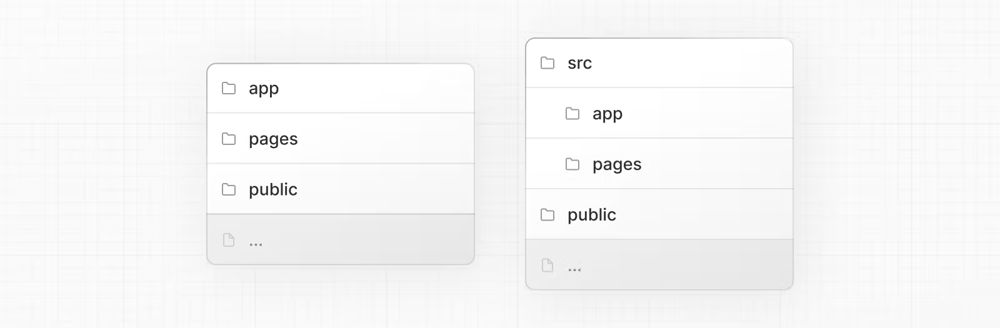

# Chapter 04 - Server Side Rendering

**SPA (Single Page Application)**
SPA는 하나의 HTML 페이지를 로드한 후에, 페이지를 동적으로 업데이트하며 필요한 데이터를 받아오는 방식을 채택한다.
초기에 필요한 자원들을 로드한 후에는, 더 이상 페이지 전체를 새로고침 하지 않아도 된다.

SPA로 개발하게 된다면, 사용자 인터렉션을 통하여 어플리케이션을 업데이트 하는 방식이기 때문에 모바일 플랫폼과의 UX적인 통일성이 생기게 된다.

사실 SPA 형태로 제대로 된 개발이 가능하게 된 것은 V8 Engine이 활성화 되고 JavaScript 환경이 큰 발전을 이루게 되면서 가능해진 영역이다.

**MPA (Multi Page Application)**
우리나라를 보았을 때 네이버가 가장 큰 MPA 서비스 일 것이다.

- 사실 MPA이긴 하지만 서비스 하나하나가 SPA 급의 규모를 가지고 있을 것이다.

페이지 전환이 발생하며, 이때마다 새롭게 페이지를 요청하고, HTML 페이지를 다운로드 하여 파싱하는 작업을 가진다.
이 과정은 페이지를 처음부터 새로 그려야 해서 일부 사용자는 페이지가 전환될 때 부자연스러운 모습을 보게된다.

- 네이버 같은 경우는 서비스 마다의 결이 다르기 때문에 서비스 전체를 SPA로 구성하는 것은 매우매우 어려운 일 일 것이다.

특히, 과거에는 JavaScript의 능력이 그렇게 큰 편이 아니었고, 브라우저의 처리 능력이 좋지 않았기에 서버나 플러그인 등을 통해 데이터를 처리하는 경우가 많았다. (Adobe Flash, IE의 ActiveX와 같은 것들)

**if 만약에 V8 엔진이 나오지 않았다면?**
Node.js 없음, 이와 관련된 환경 없음, 우리는 여전히 웹 페이지를 방문할 때 많은 시간이 들었을 것, IE 강점기 계속 ing..., 디바이스의 컴퓨팅 파워는 좋아지고 있는데 왜 나는 이 간단한 페이지의 사이트도 방문할 때마다 답답함을 느껴야하나요?

- 단순 if 놀이이기 때문에.. 어찌되었든 V8 엔진은 웹 생태계에 엄청난 발전을 일으켰습니다.
- V8 엔진이 없었으면 웹 페이지는 우리의 컴퓨팅 파워를 제대로 못 썼을 확률이 매우 높았다는 것

**CSR (Client Side Rendering)** - 서버에서 받은 데이터를 클라이언트(브라우저)에서 동적으로 렌더링하여 사용자에게 보여준다.

### SSR (Server Side Rendering)

SSR에서의 클라이언트는 초기 요청 시 서버로부터 완전히 렌더링된 페이지를 받아서 화면에 표시한다. 즉, 렌더링에 필요한 연산을 서버에서 하는 것이다.
SSR은 초기 로딩 속도를 향상시키며, **SEO(Search Engine Optimization, 검색 엔진 최적화)** 에 유리한 장점이 있다.

**_SSR은 어떻게 최초 페이지 진입을 조금 더 빠르게 만든건가요?_**
-> 규모가 조금 커진 페이지의 경우 초기 페이지 로1딩 시 여러 요청들이 엮여있는 경우가 많다. SSR의 경우 이런 요청을 서버에서 미리 연산하고 렌더링된 결과를 클라이언트에 넘겨주기 때문에 빠른 느낌이 드는 것이다.
물론, 그 만큼 서버에 대한 리소스적인 비용이 더욱 많이 발생한다.

**_검색 엔진 최적화에서는 왜 이점을 갖나요?_**
우선 검색 로봇의 동작을 알아야 한다. (검색엔진 크롤러 등으로 불리기도 함)

1. 검색 로봇(머신)이 페이지에 진입한다.
2. 페이지가 HTML 정보를 제공해 로봇이 이 HTML을 다운로드 한다. 단, 다운로드만 하고 JS 코드는 실행하지 않는다.
3. 다운로드한 HTML 페이지 내부의 오픈 그래프(Open Graph)나 메타(meta) 태그 정보를 기반으로 페이지의 검색(공유) 정보를 가져오고 이를 바탕으로 검색엔진에 저장한다

-> 즉, JS코드를 실행하지 않기 때문에 CSR은 SEO에 부적절하며 SSR은 이미 렌더링 된 화면을 보여주기 때문에 SEO에 이점을 가진다.

**_또 다른 장점_**

1. 누적 레이아웃 이동이 적다.
   -> 이는 CSR로 개발 할 시 컴포넌트의 어떠한 정보가 처음에 바인딩 되지 않아 깜빡이거나, 빈 값으로 노출되는 경우 등을 간혹 볼 수 있을 것이다. 어느정도 막을 수 있는 문제들이긴 하나 그럼에도 불구하고 사람이기 때문에 사용자가 예상치 못한 시점에서 페이지 레이아웃이 변경될 여지는 있다.
   **이런 경우는 보통 의존성이 외부에 있기 때문이다.**

SSR은 미리 연산을 모두 서버에서 하기 때문에 이런 일이 발생할 여지가 별로 없다.

2. 사용자의 디바이스 성능에 비교적 자유롭다.
   -> 렌더링에 필요한 연산이 서버에서 진행하므로 사용자는 CSR에 비하여 많은 연산을 필요로 하지 않을 것이다.
   -> 다만, 인터넷 속도는 디바이스와 논외이기 때문에 다른 방법론을 도입해야하는 경우도 있을 것이다.(절대적이지 않다)

3. 보안에 조금 더 안전하다.
   -> API 호출, 인증과 같은 작업등을 요청하는 것이 서버에서 이뤄지기 때문에 Client에서 관련 정보가 노출될 일이 없다.

**_단점_**
이부분은 SSR을 사용한다면 감수해야 될 부분들이라 생각한다.

1. 코드 작성 시 서버 환경을 기준으로 생각해야한다.
   -> window와 session storage 같은 것들은 브라우저에 존재하는 전역 객체이기 때문에 다른 처리를 해주어야 ㅎ한다.

2. 적절한 서버가 구축돼 있어야 한다.

3. 서비스 지연에 따른 문제
   -> 만약, 처음에는 빨랐다가 서버에 부하가 있어 속도가 느려지게 된다면 사용자가 느끼는 속도는 그대로 계속해서 느려지는 것이다. (거진 이런 경우라면 동시 이용자 모두가 앱이 느려짐을 느끼게 된다.)

### 현대의 서버 사이드 렌더링

React 환경의 SPA를 SSR 하기 위한 `Next.js`, `Remix` 등의 **서버 사이드 렌더링 프레임워크**가 존재한다.
과거의 SSR과 다른 점이라면, SPA 형태이기 때문에 사이트 최초 전입 시 서버에서 완성된 HTML을 제공 받고, 라우팅을 통해 서버에서 내려받은 JS를 기반으로 동작한다.

React 환경에서의 SSR의 강점을 제대로 알기 위해서는 React와 Next.js가 어떻게 동작하는 지 정확하게 알 필요가 있다.
그렇지 않다면 사실상 CSR 보다 못한 페이지를 만들 수도 있기 때문이다.

다행히 Next.js와 Remix의 경우 라이브러리가 아닌 프레임워크라는 표현을 사용하였다.
프레임워크인 만큼 자유도는 떨어지더라도, 이들이 제공하는 형태나 best practice 가 어느정도 잡혀있음을 의미한다. (제발..)

### SSR을 위한 React API 살펴보기

이 API들은 서버 환경에서만 실행할 수 있으며, Client의 브라우저 환경에서 실행 시 에러가 발생할 수 있다.
React의 SSR 실행 시 사용되는 API를 확인해보려면 react-dom/server.js를 확인하면 된다.
React 18 버전에 대한 자세한 내용은 책의 다른 챕터에 있는 것으로 보이니 우선 스킵

**_renderToString_**
인수로 넘겨받은 React 컴포넌트를 렌더링 하여 HTML 문자열로 반환하는 함수

**_renderToStaticMarkup_**
reactToString과 매우 유사하나, react에서만 사용하는 추가적인 DOM 속성을 만들지 않는다.
이는, 결과물인 HTML의 크기를 아주 약간이나마 줄일 수 있다는 장점이 있다.
단, renderToStaticMarkup의 결과물은 hydrate를 수행할 수 없으므로 static 한 결과물일 것이라는 가정하에 사용해야한다.
바뀔 여지가 없는 컴포넌트들에게 사용하면 좋을 것으로 보인다.

**_renderToNodeStream_**
위의 두 결과물과 유사하지만 또 다른 차이점이 있다. 위 두 API는 브라우저에서도 실행할 수는 있었지만 renderToNodeStream은 사용이 불가능하다. 이유는 Node.js 환경에 의존하고 있는 API 이기 때문이다.

그리고 결과물의 타입 또한, string이 아닌 Node.js의 `ReadableStream` 이다.
`ReadableStream`은 utf-8로 인코딩 된 바이트 스트림으로, Node.js나 Deno, Bun 같은 서버환경에서만 사용할 수 있다.
궁극적으로 브라우저가 원하는 결과물, 즉 string을 얻기 위해서는 추가적인 처리를 필요로 한다.

스트림을 활용하여 브라우저에 제공해야 할 규모가 큰 HTML을 작은 단위로 쪼개어 연속적으로 작성할 수 있다.
이렇게 된다면 Node.js 서버의 렌더링 부담도 덜 수 있으며, 대부분의 널리 알려진 React SSR Framework는 모두 renderToString 대신 renderToNodeStream을 채택하고 있다.

**_renderToStaticNodeStream_**
renderToNodeStream과 제공하는 결과물은 동일하나, react 속성을 제공하지 않는다.
이또한 마찬가지로 순수한 HTML 결과물이 필요할 때 사용한다.

**_hydrate_**
hydrate는 수분을 유지시키다, 채운다 라는 의미로 SSR에서 react의 state 변화로 인한 re-render를 대용하는 용어라 볼 수 있다.
앞서 살펴 본 renderToString이나 renderToNodeStream으로 생성된 HTML 콘텐츠에 자바스크립트 핸들러나 이벤트를 붙이는 역할을 한다.
hydrate의 경우 서버에서 제공해 준 HTML이 클라이언트가 정상적으로 받아 **_같은 결과물_**을 가지고 있을 거라는 가정하에 실행이 된다.

따라서, hydrate로 넘겨준 두 번째 인수에는 이미 렌더링 된 정적인 HTML 정보가 반드시 담겨져 있어야 한다.
만약 불가피하게 같은 결과물을 가지고 있지 않을 것 같은 요소에는 suppressHydrationWarning 속성을 넣어 제외 시킬 수 있다. (하지만 굉장히 제한적으로 사용해야 할 것으로 보인다.)

### Next.js

React SSR Framework 이며 아마 SSR Framework 중 현재 가장 많이 사용되고 있을 것으로 보인다.
현재 v14 까지 릴리즈 되었으며, 책에서는 v13 기준으로 작성을 한 것으로 보여 변경점이 있을 것이다.

책에서의 Next.js 예제 대신, Next.js의 기본적인 특징을 서술하고 이번 챕터를 마쳐보겠다. (TODO : 현재 기준 예제 추가)

next.js는 App Router와 Pages Router 라는 두 가지 라우터가 존재한다.

- **App Router** - v13 부터 추가된 내용인 것으로 보인다. 서버 컴포넌트와 스트리밍과 같은 React의 최신 기능을 사용할 수 있다.

- **Pages Router** - 기존 Next.js 라우터이며, 서버 렌더링된 React App을 구축하는 데 사용되며 이전 Next.js App을 지원한다.

Next.js는 프로젝트 구조가 어느정도 정형화 되어있다.

- app - App Router
- pages - Pages Router
- public - Static assets to be served
- src - Optional application source folder

디렉토리 명을 따라야 하며, 따르지 않을 경우 예상하는 결과가 안나올 수 있다.
또한, top-level files나 app Routing convention 등 여러가지 컨벤션 들이 정해져 있다.
Next.js를 직접적으로 사용하기 전에 이부분을 먼저 숙지하는 것이 좋아보인다..

링크 : [next.js docs/project-structure](https://nextjs.org/docs/getting-started/project-structure)

이런 부분들은 책을 맹신하는 것 보다 next.js의 docs를 보고 다시 크로스체킹 해야할 것으로 보인다.
메이저 버전이 생각보다 활발하게 업데이트 되고 있기 때문이다.
