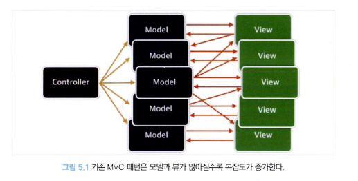
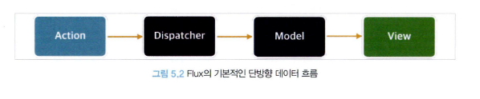
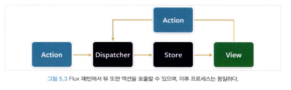

# React 상태 관리 라이브러리

### 상태 관리는 왜 필요한가 ?

**_상태 ?_**
웹 애플리케이션을 개발할 때 이야기 하는 상태란, 어떠한 의미를 지닌 값이며 애플리케이션의 시나리오에 따라 지속적으로 변경될 수 있는 값을 의미한다.

웹 애플리케이션에서 상태로 분류될 수 있는 것들은 대표적으로 다음과 같은 것들이 있다.

- UI : 기본적으로 웹 애플리케이션에서 상태라 함은 상호 작용이 가능한 모든 요소의 현재 값을 의미한다.
- URL : 브라우저에서 관리되고 있는 상태값으로, 라우팅 주소에 따라 페이지의 상황을 알 수 있다.
- 폼 (Form) : 폼에도 상태가 존재한다. 로딩중(loading)인지, 제출(submit)이 되었는지, 접근(disabled)이 불가능한지, 유효(validate)한 지 등 모두가 상태로 관리된다.
- Fetching Data : 서버에서 가져온 값을 상태로 둘 수도 있다. (데이터를 받았는 지에 대한 유무)

SPA 형태의 웹앱 개발 시에는 상태관리는 앱의 스케일이 커지면 커질 수록 관리하기 힘들어 진다.
상태가 많아지면 많아질 수록 예상치 못한 결과를 볼 수 있고, tearing과 같은 현상이 일어나게된다면 수정하는 데 생각보다 많은 공수를 들일 수도 있다.

필연적으로 현대 웹 애플리케이션을 개발한다면 상태관리는 중요한 주제가 될 것이다.
물론 어떤 상태관리 라이브러리를 사용하더라도 웹 앱을 개발하는 것에는 문제가 되진 않을 것이다.
하지만, 선택에 따라 원하는 결과에 도달할 때 조금 더 쉽게 도달할 수 있을 것이다.

### Flux ? Redux ?

위의 이미지는 기존 MVC 패턴
아래는 Flux 패턴의 데이터 흐름이다.

MVC 패턴에서 뷰와 모델이 많아짐에따라 컨트롤러에서 서로의 상태를 간섭하다보니, Side Effect에 대한 이슈가 염려된다.
페이스북은 이러한 문제를 해결하기 위해 Flux 패턴을 제안한다.

- 액션 (action) : 어떠한 작업을 처리할 액션과 그 액션 발생 시 함께 포함시킬 데이터를 의미, 액션 실행 시 디스패처로 보낸다.
- 디스패처 (dispatcher) : 액션을 스토어로 보내는 역할을 한다. 콜백 함수 형태로 앞서 액션이 정의한 타입과 데이터를 모두 스토어에 보낸다.

- 스토어 (store) - 여기에서 액션의 타입에 따라 실제 상태에 따른 값과 상태를 변경할 수 있는 메서드를 가지고 있다.

- 뷰 (view) : 리액트 컴포넌트에 해당하는 부분으로, 스토어에서 만들어진 데이터를 가져와 화면에 렌더링하는 역할을 한다.

redux는 위 flux 패턴을 react 환경에서 사용할 수 있도록 한 라이브러리 이다.

### React Query, SWR

두 라이브러리는 모두 외부에서 데이터를 불러오는 fetch를 관리하는 데 특화된 라이브러리이다.

API 호출에 대한 상태를 관리하고 있기 때문에 HTTP 요청에 특화된 상태 관리 라이브러리라 볼 수 있다.

### Recoil, Zustand, Jotai, Valtio

**_Recoil_**

페이스북에서 만든 React를 위한 상태 관리 라이브러리 이며, React 훅의 개념으로 상태관리를 시작한 최초의 라이브러리이다.

최소 상태 개념인 Atom을 기준으로 상태를 관리한다.

아직까지도 1.0.0 릴리즈가 되지 않았다.

**_Jotai_**
Recoil의 Atom 모델에 영감을 받아 만들어진 상태관리 라이브러리이며, Jotai는 을 취하고 있다.
작은 단위의 상태를 위로 전파하는 (Bottom-up) 구조를 취하고 있다.

**_Zustand_**

Jotai는 Recoil의 영감을 받아 만들어 졌다면, Zustand는 리덕스에 영감을 받아 만들어졌다.
Zustand는 하나의 스토어를 중앙 집중형으로 활용하여 이 스토어 내부에서 상태를 관리한다.

그러나, state slices 를 통해 Store를 만들 수도 있다.

**_Valtio_**

JS의 proxy를 사용하여 전역상태를 관리하는 라이브러리이다.
상태를 직접 변경하는 대신 프록시 객체를 사용하여 상태를 감싸고 변경을 추적한다.
매우 복잡한 상태 관리 시스템이 필요한 경우에는 적합하지 않은 상태 관리 라이브러리라고 한다.
