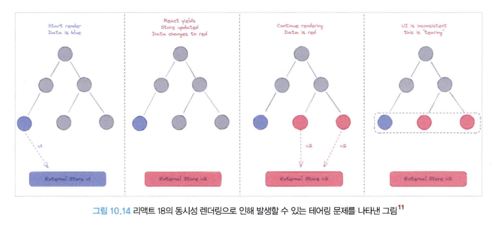

# React 17과 18에서의 변경사항

책에서는 16버전을 자주 사용하는 것으로 통계가 나와서, 요즘은 어떤가 싶어 자료를 찾아보았다.


현재는 16버전의 점유율이 점점 내려가는 추세인 것으로 보이긴 하지만 아직 애매한 수치인 것으로 보인다.
15 버전의 점유율은 점점 내려가고 있으며, 17버전은 유지 중 인것으로 보인다.
18버전의 점유율은 꾸준히 점점 올라가고 있다. (현재 latest)

넷플릭스는 18버전으로 올렸다.

### React 17 버전

#### 점진적 업데이트

17버전은 16버전의 호환성을 최대한 유지하는 것을 목표로 한 버전이다.
17버전 이후의 버전부터는 점진적으로 업그레이드가 가능하다.
현재 사용하는 버전보다 이전 버전의 React API를 사용하는 경우 이전 버전의 API를 Lazy하게 불러온다.
이때 이전 버전을 위한 별도의 루트 요소를 만들고, 이 곳에 이전 버전의 모듈을 렌더링하는 구조로 되어있다.

어지간한 경우가 아니라면, react 업데이트 시 앱이 무리없이 실행된다는 것
이전에는 react 버전을 업데이트 할 경우 에러가 나서 변경점을 찾아보는 경우가 잦았다.

#### 이벤트 위임 방식의 변경

React에서 이벤트를 바인딩 하는 방식이라하면, 아래와 같이 정의할 것이다.

```JSX
...
    <Button onClick={(e)=>clickEvent(e)}> </Button>
```

이렇게 이벤트를 바인딩 하였을 때, 실제 DOM 상에서 Button의 이벤트의 핸들러에는 `noop` 함수가 달려있고, 이 함수는 정말 아무것도 하지 않는다. ( `function noop() {}` )

리액트는 이벤트 처리 시 일반적인 DOM 요소처럼 처리하는 것이 아닌, 다른 방식이 존재한다는 의미이다.

리액트는 이벤트 타입(click, change ...) 당 하나의 핸들러를 루트에 부착한다. 이를 **이벤트 위임** 이라 한다.

아래는 이벤트를 구성하고 있는 단계이다.

1. 캡처(capture) : 이벤트 핸들러가 트리 최상단 요소에서 부터 시작해서 실제 이벤트가 발생한 타깃 요소까지 내려가는 것을 의미한다.
2. 타깃(target) : 이벤트 핸들러가 타깃 노드에 도달하는 단계다. 이 단계에서 이벤트가 호출된다.
3. 버블링(bubbling) : 이벤트가 발생한 요소에서부터 시작해 최상위 요소까지 다시 올라간다.

이벤트 위임이란 이러한 이벤트 단계의 원리를 활용해 이벤트를 상위 컴포넌트에만 붙이는 것을 의미한다.
16버전까지는 document에서 수행되고 있었으나, 17버전 이훙레서는 최상단 컴포넌트인 root 요소로 바뀌었다.

이렇게 이벤트 위임을 하는 이유로는, 다른 바닐라 스크립트 혹은 jQuery와 같이 직접적인 DOM을 사용하는 라이브러리 등이 혼재 되어있는 경우 혼란을 방지하기 위함이다.


#### 새로운 JSX transform

React 17 부터 바벨과 협력하여 import 구문 없이도 JSX를 변환할 수 있게 되었음
이전에는 `import React from 'react'` 를 붙여주어야 했으나, 이제는 그럴 필요 없어졌다.
`swc`도 `babel`처럼 해줄 수 있는 것으로 보인다.

#### 그 밖의 주요 변경 사항

- 이벤트 풀링 제거 : 브라우저의 기본 이벤트를 한번 더 감싸는 `SyntheticEvent` 라는 이벤트 객체가 있었는데, 브라우저 기본 이벤트가 아닌, 한번 래핑한 이벤트를 사용하기 때문에 이벤트가 발생할 때 마다 이 이벤트를 새로 만들어야 하므로 메모리 관리가 필요하였다.

모던 브라우저에서는 이러한 이벤트 처리에 대한 성능이 많이 개선되었기 때문에, 의미가 퇴색되었으므로 이제는 삭제된 개념이다.

- useEffect 클린업 함수 비동기 실행 : 컴포넌트의 커밋 단계가 완료될 때 까지 지연된다.

- 컴포넌트의 undefined 반환에 대한 일관적인 처리 : 컴포넌트 내부에서 undefined 반환시 에러 처리, 근데 18에서는 에러 처리가 발생되지 않는다고 함(?)

### React 18 버전 살펴보기

React 18의 가장 큰 변경점은 동시성 지원이며, 이 동시성 지원은 React 개발팀이 수년간 고민을 했었던 내용이였다.

#### 새로 추가된 훅

**_useId_** : 컴포넌트별로 유니크한 값을 생성하는 훅
React를 사용하는 개발자 입장에서 컴포넌트 내부에서 사용할 수 있는 unique 한 값을 만드는 것은 쉽지 않다.
이 부분은, SSR 환경에서 Hydration이 일어날 때 서버와 클라이언트가 동일한 값을 가져야 에러가 발생하지 않는데, 이러한 부분을 useId로 해결할 수 있다.

**_useTransition_** : UI 변경을 가로막지 않고 상태를 업데이트 할 수 있는 리액트 훅
상태 업데이트를 긴급하지 않은 것으로 간주하여, 무거운 렌더링 작업을 미룰 수 있는 것이 특징이다.
React Lane에서 Transition은 후순위에 배치되어있다.
이러한 부분들은 개발자가 능동적으로 사용하는 것도 중요하지만 프로젝트의 UX적인 요소가 중요할 것으로 보인다.

**_useDeferredValue_** : 리렌더링이 급하지 않은 부분을 지연할 수 있게 도와주는 훅이다.
useTransition과 다른 점으로는 useTransition은 state 값을 업데이트 하는 함수를 감싸서 사용하지만,
useDefferedValue는 state 값 자체만을 감싸서 사용한다.

어떠한 list가 text 값에 의존하여 변경된다 했을 때, text 값이 변경되면 list는 게속해서 업데이트가 이뤄질 것이다.
하지만 이때 text 값을 바라보는 defferedText 가 있고, list는 defferedText를 바라보게 된다면, text 값이 변경되자마자 업데이트 되는 것이 아닌 지연되어 업데이트되는 defferedText를 바라보기 때문에 text 값이 자주 변경됨으로 인해서 쓸데없는 렌더링 요청을 막을 수 있다.

debounce와의 차이점이라면, debounce는 결국 특정 시간 이후에 값이 변경되는 것을 캐치하는 방법이지만, useDefferedValue는 고정된 지연 시간이 따로 없는 것이 장점이다.

**_useSyncExternalStore_** : 동시성 지원으로 인하여 외부에서 사용하는 상태관리자들에 대한 처리도 중요해졌다.
react에서 관리하는 것이 아닌, `글로벌 변수, document.body, window.innerWith, DOM, React External State Manager` 등이 동시성을 지원하는 React 18에서 아무 처리 없이 적용될 경우 Tearing 문제가 일어날 수 있다.



이 훅은 일반적인 react 개발자가 사용할 일은 없고, 보통 상태관리 라이브러리를 개발하는 팀들이 사용한다.

zustand가 이 훅을 이용해서 store를 구성한다.
그래서, 이 훅을 통해 구성된 store의 경우 store 안의 state가 변경되었을 때, react 리렌더링을 발생시킬 수 있다.

**_useInsertionEffect_** : CSS-in-js 라이브러리를 위한 훅이다
Next.js에서 styled-components를 적용하는 예제를 보았을 때, \_document.tsx에 styled-components가 사용하는 스타일을 모두 모아서 서버 사이드 렌더링 이전에 <style> 태그에 삽입하는 과정을 가진다고 하였다.

이때, CSS의 추가 및 수정은 브라우저에서 렌더링하는 작업 대부분을 다시 계산해 작업해야 하며, React 관점으로 본다면 모든 리액트 컴포넌트에 영향을 미칠 수 있는 무거운 작업이다.

React 17까지만 하더라도, 이러한 문제로 인해 서버사이드에서 스타일 코드를 직접 삽입하는 방법을 사용했었다고 한다.

React 18에서는 훅에서 이러한 작업을 할 수 있도록 도와주는 새로운 훅이 나왔는데 그것이 바로 `useInsertionEffect` 이다.

기본적인 훅 구조는 useEffect와 동일하나, 실행 시점이 다르다.
`useInsertionEffect`는 DOM이 실제로 변경되기 전에 **동기적**으로 실행된다.
이 훅 내부에 스타일을 삽입하는 코드를 집어넣음으로써 브라우저가 레이아웃을 계산하기 전에 실행될 수 있게끔 하여 좀 더 자연스러운 스타일 삽입이 가능해진다.

다른 훅과 비교했을 때 실행순서는 다음과 같다.

```javascript
function Index() {
  useEffect(() => {
    console.log("useEffect! "); // 3
  });
  useLayoutEffect(() => {
    console.log(" useLayoutEff ect ! "); // 2
  });
  uselnsertionEffect(() => {
    console.log(" uselnsertionEff eet ! "); // 1
  });
}
```

#### react-dom/client

클라이언트에서 리액트 트리를 만들 때 사용되는 API가 변경되었다.

**_createRoot_** : 기존의 react-dom에 있던 render 메서드를 대체할 새로운 메서드이다.
**_hydrateRoot_** : SSR에서는 hydration을 하기 위한 새로운 메서드이다. (Next.js가 알아서 해줌)

#### react-dom/server

#### 자동 배치(Automatic Batching)

#### 더욱 엄격해진 strict mode

#### suspense 강화

### + 차기 React 업데이트 예고

@TODO에용
