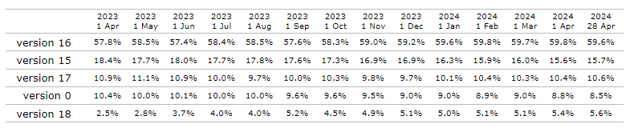

# React 17과 18에서의 변경사항

책에서는 16버전을 자주 사용하는 것으로 통계가 나와서, 요즘은 어떤가 싶어 자료를 찾아보았다.



현재는 16버전의 점유율이 점점 내려가는 추세인 것으로 보이긴 하지만 아직 애매한 수치인 것으로 보인다.
15 버전의 점유율은 점점 내려가고 있으며, 17버전은 유지 중 인것으로 보인다.
18버전의 점유율은 꾸준히 점점 올라가고 있다. (현재 latest)

넷플릭스는 18버전으로 올렸다.

### React 17 버전

#### 점진적 업데이트

17버전은 16버전의 호환성을 최대한 유지하는 것을 목표로 한 버전이다.
17버전 이후의 버전부터는 점진적으로 업그레이드가 가능하다.
현재 사용하는 버전보다 이전 버전의 React API를 사용하는 경우 이전 버전의 API를 Lazy하게 불러온다.
이때 이전 버전을 위한 별도의 루트 요소를 만들고, 이 곳에 이전 버전의 모듈을 렌더링하는 구조로 되어있다.

어지간한 경우가 아니라면, react 업데이트 시 앱이 무리없이 실행된다는 것
이전에는 react 버전을 업데이트 할 경우 에러가 나서 변경점을 찾아보는 경우가 잦았다.

#### 이벤트 위임 방식의 변경

React에서 이벤트를 바인딩 하는 방식이라하면, 아래와 같이 정의할 것이다.

```JSX
...
    <Button onClick={(e)=>clickEvent(e)}> </Button>
```

이렇게 이벤트를 바인딩 하였을 때, 실제 DOM 상에서 Button의 이벤트의 핸들러에는 `noop` 함수가 달려있고, 이 함수는 정말 아무것도 하지 않는다. ( `function noop() {}` )

리액트는 이벤트 처리 시 일반적인 DOM 요소처럼 처리하는 것이 아닌, 다른 방식이 존재한다는 의미이다.

리액트는 이벤트 타입(click, change ...) 당 하나의 핸들러를 루트에 부착한다. 이를 **이벤트 위임** 이라 한다.

아래는 이벤트를 구성하고 있는 단계이다.

1. 캡처(capture) : 이벤트 핸들러가 트리 최상단 요소에서 부터 시작해서 실제 이벤트가 발생한 타깃 요소까지 내려가는 것을 의미한다.
2. 타깃(target) : 이벤트 핸들러가 타깃 노드에 도달하는 단계다. 이 단계에서 이벤트가 호출된다.
3. 버블링(bubbling) : 이벤트가 발생한 요소에서부터 시작해 최상위 요소까지 다시 올라간다.

이벤트 위임이란 이러한 이벤트 단계의 원리를 활용해 이벤트를 상위 컴포넌트에만 붙이는 것을 의미한다.

#### 새로운 JSX transform

#### 그 밖의 주요 변경 사항

### React 18 버전 살펴보기

#### 새로 추가된 훅

#### react-dom/client

#### react-dom/server

#### 자동 배치(Automatic Batching)

#### 더욱 엄격해진 strict mode

#### suspense 강화

### + 차기 React 업데이트 예고
